# Google Cybersecurity Study Guide

This repository reorganizes personal notes from the Google Cybersecurity Certificate on Coursera into a cleaner study guide. It is designed for review, revision, and interview preparation rather than as a raw archive of course text.

## What this repo covers

- Security fundamentals and analyst skills
- Common attack types and how to classify them
- Threat actors and security ethics
- Controls, frameworks, and compliance
- Security analyst tools and response workflows
- Network architecture, protocols, firewalls, proxies, and VPNs
- Detection, incident response, phishing triage, packet analysis, and investigation documentation
- Linux command-line basics and file permissions
- SQL querying for structured security investigations
- Asset inventories, risk registers, and threat modeling
- Course 5 activity practice: home asset inventories, USB risk analysis, data leak worksheets, access control reviews, and PASTA artifacts
- The Botium Toys audit case study
- A curated glossary and a practical study plan

## How to use it

1. Start with [docs/01-foundations.md](docs/01-foundations.md).
2. Move through the topics in order.
3. Use [docs/12-networking-and-network-security.md](docs/12-networking-and-network-security.md), [docs/09-linux-and-permissions.md](docs/09-linux-and-permissions.md), [docs/10-sql-for-security-analysis.md](docs/10-sql-for-security-analysis.md), and [docs/11-assets-risk-and-threat-modeling.md](docs/11-assets-risk-and-threat-modeling.md) for hands-on practice.
4. Use [docs/13-course-5-activities-and-portfolio.md](docs/13-course-5-activities-and-portfolio.md) to turn course worksheets into portfolio-ready analyst notes.
5. Use [docs/14-detection-and-incident-response.md](docs/14-detection-and-incident-response.md) to practice Course 6 alert triage, phishing response, packet analysis, file-hash investigation, and incident reporting.
6. Use [docs/07-glossary.md](docs/07-glossary.md) as a quick lookup reference.
7. Use [docs/08-study-plan.md](docs/08-study-plan.md) for revision and interview prep.
8. Review [docs/06-botium-toys-case-study.md](docs/06-botium-toys-case-study.md) before any governance, risk, or audit assessment.

## Study map

```mermaid
flowchart LR
    A["Foundations"] --> B["Threats and Attacks"]
    B --> C["Threat Actors and Ethics"]
    C --> D["Controls, Frameworks, and Compliance"]
    D --> E["Analyst Toolkit and Response"]
    E --> F["Networking Practice"]
    F --> G["Linux and SQL Practice"]
    G --> H["Assets, Risk, and Threat Modeling"]
    H --> I["Course 5 Activity Practice"]
    I --> J["Detection and Incident Response"]
    J --> K["Botium Toys Case Study"]
    K --> L["Glossary and Revision"]
```



## Repository layout

```text
.
|-- README.md
|-- docs/
|   |-- 01-foundations.md
|   |-- 02-threats-and-attacks.md
|   |-- 03-threat-actors-and-ethics.md
|   |-- 04-controls-frameworks-compliance.md
|   |-- 05-analyst-toolkit.md
|   |-- 06-botium-toys-case-study.md
|   |-- 07-glossary.md
|   |-- 08-study-plan.md
|   |-- 09-linux-and-permissions.md
|   |-- 10-sql-for-security-analysis.md
|   |-- 11-assets-risk-and-threat-modeling.md
|   |-- 12-networking-and-network-security.md
|   |-- 13-course-5-activities-and-portfolio.md
|   |-- 14-detection-and-incident-response.md
|   |-- images/
|   `-- references.md
`-- sources/
    `-- source-index.md
```

## Scope note

These notes are paraphrased and reorganized from personal course materials. They are intended as a personal learning aid and reference set, not as an official course replacement.

## Recommended review flow

- Learn the vocabulary in context, not as isolated definitions.
- Tie every concept back to a control, risk, or response action.
- Practice classifying incidents by attack type, control type, and business impact.
- Practice reading network alerts by source, destination, port, protocol, and direction.
- Practice Linux permission interpretation and SQL filters with the worked examples.
- Treat every asset, vulnerability, and control as part of a risk story.
- Turn each Course 5 worksheet into a short artifact: scenario, evidence, issue, recommendation, and justification.
- Revisit the Botium Toys case study after each theory section.

## Beginner shortcut

If you are new to cybersecurity, use this simple order:

1. Learn the core language in foundations, threats, and controls.
2. Practice analyst tools with networking, Linux, and SQL.
3. Practice risk thinking with asset inventories and risk registers.
4. Use the Course 5 activity chapter to write portfolio-style answers.
5. Use the Course 6 incident-response chapter to practice alert triage, packet analysis, and incident documentation.
6. Review the glossary whenever a term slows you down.

## Fast checkpoints

- Can you explain the CIA triad without reading?
- Can you distinguish phishing, malware, and social engineering?
- Can you map a control to administrative, technical, or physical categories?
- Can you explain when a security analyst should defend, escalate, document, and preserve evidence?
- Can you explain what TCP/IP layer a protocol belongs to?
- Can you identify common ports like DNS 53, SSH 22, HTTPS 443, and DHCP 67/68?
- Can you triage a phishing alert by checking sender, recipient, attachment, links, hash, and user action?
- Can you explain when Wireshark, tcpdump, TShark, SIEM, IDS/IPS, EDR, and SOAR are useful?
- Can you read a Linux permission string like `-rw-rw-r--`?
- Can you write a basic SQL query with `SELECT`, `FROM`, `WHERE`, and `ORDER BY`?
- Can you build a simple risk register using likelihood and severity?
- Can you explain why a former contractor account with admin access is a security issue?
- Can you map a data leak recommendation to least privilege and NIST CSF Protect?

## Official references

See [docs/references.md](docs/references.md) for primary links such as the NIST glossary, NIST frameworks, and CompTIA Security+.
