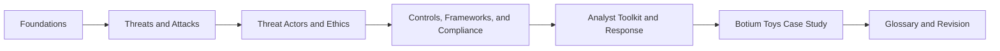

# Google Cybersecurity Study Guide

This repository reorganizes personal notes from the Google Cybersecurity Certificate on Coursera into a cleaner study guide. It is designed for review, revision, and interview preparation rather than as a raw archive of course text.

## What this repo covers

- Security fundamentals and analyst skills
- Common attack types and how to classify them
- Threat actors and security ethics
- Controls, frameworks, and compliance
- Security analyst tools and response workflows
- The Botium Toys audit case study
- A curated glossary and a practical study plan

## How to use it

1. Start with [docs/01-foundations.md](docs/01-foundations.md).
2. Move through the topics in order.
3. Use [docs/07-glossary.md](docs/07-glossary.md) as a quick lookup reference.
4. Use [docs/08-study-plan.md](docs/08-study-plan.md) for revision and interview prep.
5. Review [docs/06-botium-toys-case-study.md](docs/06-botium-toys-case-study.md) before any governance, risk, or audit assessment.

## Study map



## Repository layout

```text
.
|-- README.md
|-- docs/
|   |-- 01-foundations.md
|   |-- 02-threats-and-attacks.md
|   |-- 03-threat-actors-and-ethics.md
|   |-- 04-controls-frameworks-compliance.md
|   |-- 05-analyst-toolkit.md
|   |-- 06-botium-toys-case-study.md
|   |-- 07-glossary.md
|   |-- 08-study-plan.md
|   `-- references.md
`-- sources/
    `-- source-index.md
```

## Scope note

These notes are paraphrased and reorganized from personal course materials. They are intended as a personal learning aid and reference set, not as an official course replacement.

## Recommended review flow

- Learn the vocabulary in context, not as isolated definitions.
- Tie every concept back to a control, risk, or response action.
- Practice classifying incidents by attack type, control type, and business impact.
- Revisit the Botium Toys case study after each theory section.

## Fast checkpoints

- Can you explain the CIA triad without reading?
- Can you distinguish phishing, malware, and social engineering?
- Can you map a control to administrative, technical, or physical categories?
- Can you explain when a security analyst should defend, escalate, document, and preserve evidence?

## Official references

See [docs/references.md](docs/references.md) for primary links such as the NIST glossary, NIST frameworks, and CompTIA Security+.
