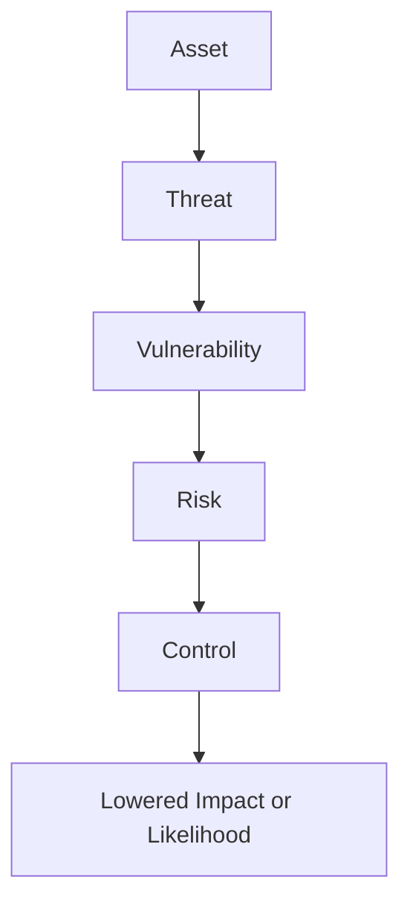

# 01 Foundations

## Core idea

Cybersecurity is the practice of protecting systems, networks, devices, people, and data from unauthorized access and criminal misuse. A security analyst helps reduce risk by monitoring activity, investigating issues, and improving defenses.

## Core principles

### CIA triad

| Principle | Meaning | Analyst question |
| --- | --- | --- |
| Confidentiality | Only authorized people should access data | Who should be able to see this? |
| Integrity | Data should remain accurate and trustworthy | Has anything been changed without approval? |
| Availability | Systems and data should be accessible when needed | Can authorized users get what they need on time? |

### Risk language

| Term | Plain meaning |
| --- | --- |
| Asset | Something valuable to the organization |
| Threat | Something that could cause harm |
| Vulnerability | A weakness that can be exploited |
| Risk | The potential impact when a threat meets a vulnerability |
| Security posture | How well the organization can defend and respond |

## Important operating concepts

- Compliance means following required laws, standards, and internal policies.
- Security frameworks provide structure for managing risk.
- Security controls are safeguards used to lower specific risks.
- Internal threats can be malicious or accidental.
- Network security focuses on protecting infrastructure, data flows, and connected systems.
- Cloud security focuses on secure configuration, access control, and protection of hosted assets.

## Analyst skill model

### Transferable skills

- Communication
- Problem-solving
- Time management
- Growth mindset
- Working well with diverse perspectives

### Technical skills

- Basic programming for automation and analysis
- SIEM tooling
- Intrusion detection and monitoring
- Incident response
- Understanding the threat landscape

## What an entry-level analyst actually does

- Reviews alerts and logs
- Investigates suspicious activity
- Documents evidence and findings
- Escalates incidents through established procedures
- Recommends controls and process improvements

## Mental model

## What to memorize

- The CIA triad
- The difference between a threat, vulnerability, and risk
- The difference between frameworks and controls
- Why security posture matters
- The blend of technical and non-technical skills in analyst work

## Quick self-test

1. What is the difference between compliance and security posture?
2. Why can an accidental employee action still count as an internal threat?
3. Why does an analyst need both technical skill and communication skill?
