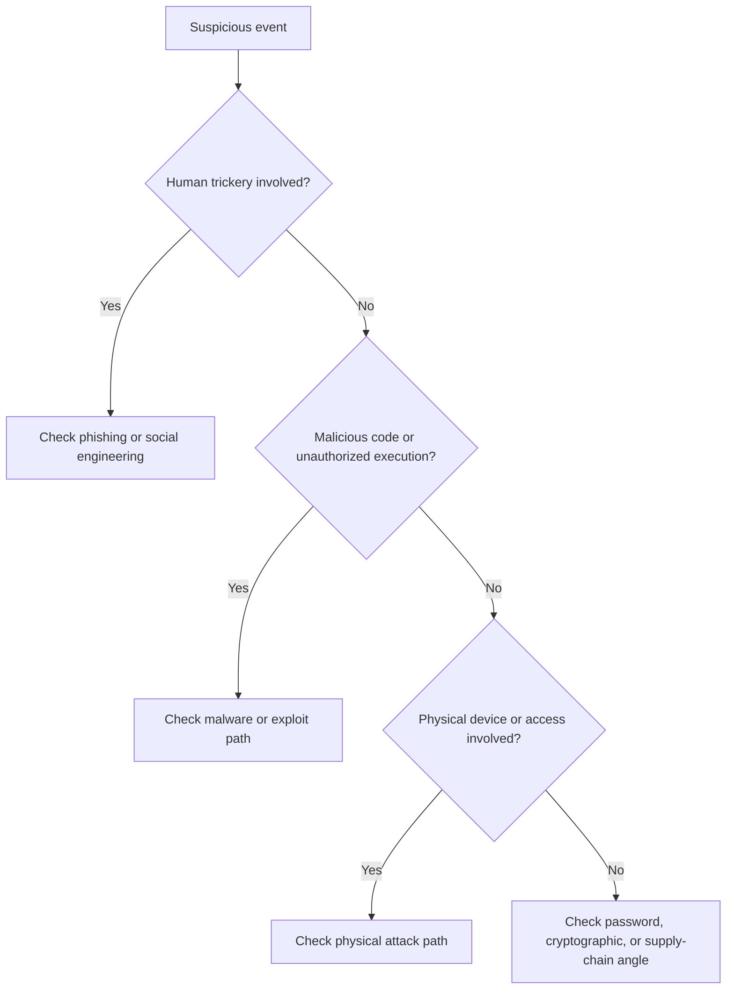

# 02 Threats and Attacks

## High-level view

Attack classification matters because different attacks require different detection methods, controls, and escalation paths.

## Common attack families

### Phishing

Phishing uses digital communication to trick someone into revealing data or performing unsafe actions.

| Type | Description |
| --- | --- |
| BEC | Impersonates a trusted sender for financial gain |
| Spear phishing | Targets a specific person or team |
| Whaling | Targets executives or senior staff |
| Vishing | Uses phone or voice channels |
| Smishing | Uses text messages |

### Malware

Malware is software built to damage systems, steal data, or create unauthorized access.

| Type | Description |
| --- | --- |
| Virus | Needs user action to execute and spread |
| Worm | Self-replicates across systems without user action |
| Ransomware | Encrypts data and demands payment |
| Spyware | Secretly collects information |
| Trojan horse | Looks like a legitimate file or program |
| Adware | Displays ads and can become unwanted or abusive |
| Scareware | Uses fear to trick users into unsafe action |
| Fileless malware | Uses trusted installed tools and memory instead of a normal file |
| Rootkit | Provides remote administrative access |
| Botnet | Infected machines controlled by a threat actor |
| Dropper | Delivers and installs malicious code |
| Loader | Downloads additional malicious code from another source |

### Social engineering

Social engineering exploits human trust and decision-making rather than technical weaknesses alone.

| Type | Description |
| --- | --- |
| Social media phishing | Builds a target profile from public data |
| Watering hole | Compromises a site the target group often visits |
| USB baiting | Tricks a user into plugging in a malicious device |
| Physical social engineering | Uses impersonation to gain physical access |
| Baiting | Tempts someone into unsafe action, such as plugging in a USB drive |
| Quid pro quo | Promises a reward or service in exchange for access, data, or money |
| Tailgating | Follows an authorized person into a restricted area |
| Angler phishing | Impersonates customer support on social media |

## Why social engineering works

- Authority
- Intimidation
- Social proof
- Scarcity
- Familiarity
- Trust
- Urgency

## Additional attack types from the notes

| Attack type | Example | Useful classification |
| --- | --- | --- |
| Password attack | Brute force, rainbow table | Communication and network security |
| Physical attack | Malicious USB cable, card skimming | Asset security |
| Adversarial AI | Manipulating AI or ML systems | Network plus identity concerns |
| Supply-chain attack | Compromised vendor software or hardware | Cross-domain risk |
| Cryptographic attack | Birthday, collision, downgrade | Communication and network security |
| Injection attack | User input changes application commands | Application security |
| Cross-site scripting | Malicious script runs in a website or browser context | Application security |
| SQL injection | Unexpected database query executes | Application and database security |
| Brute force attack | Repeated guesses against credentials or keys | Identity and access management |

## Web and application attacks

Application attacks often happen where user input meets code. Common input points include login forms, search bars, URL parameters, comments, and API fields.

| Attack | What happens | Defensive idea |
| --- | --- | --- |
| SQL injection | Input changes a database query | Prepared statements, input validation, least privilege database accounts |
| Stored XSS | Malicious script is saved on the server and shown to users later | Output encoding, input validation, content security policy |
| Reflected XSS | Malicious script is sent in a request and reflected in the response | Output encoding and safe request handling |
| DOM-based XSS | Browser-side code changes the page in an unsafe way | Safe DOM APIs and client-side validation |

Prepared statements are especially important for SQL injection because they separate query logic from user-provided data.

## Brute force defenses

Brute force attacks try many possible passwords, keys, or combinations until one works. Attackers may use tools such as Hashcat, John the Ripper, Ophcrack, THC Hydra, or Aircrack-ng. Security professionals may also use these tools in authorized testing.

Useful defenses:

- MFA
- Strong password policy
- Account lockout or rate limiting
- CAPTCHA where appropriate
- Hashing and salting for stored passwords
- Monitoring for repeated failed attempts
- Blocking or challenging suspicious sources

## Practical analyst cues

### Signs of phishing

- Unusual sender or tone
- Urgent requests for action
- Link mismatch
- Unexpected attachments
- Requests for credentials, money, or access

### Signs of malware impact

- Sudden encryption or file lockout
- Unexpected outbound traffic
- Slower systems
- New processes or services
- Unauthorized changes to files

## Attack triage shortcut

## What to memorize

- The difference between phishing, malware, and social engineering
- The major phishing subtypes
- The reasons social engineering succeeds
- The analyst value of attack classification

## Quick self-test

1. How is a worm different from a virus?
2. Why is USB baiting a social engineering attack?
3. What makes BEC different from general phishing?
