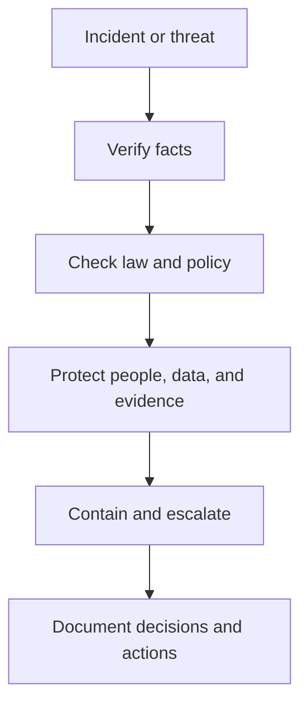

# 03 Threat Actors and Ethics

## Threat actor categories

Threat actors differ by access level, skill, motive, and persistence.

| Threat actor | Typical motive | Typical risk |
| --- | --- | --- |
| Advanced persistent threat | Espionage, disruption, long-term access | High impact and hard to detect |
| Insider threat | Sabotage, fraud, data leakage, misuse of access | Dangerous because access is already trusted |
| Hacktivist | Political or social agenda | Public disruption, defacement, data exposure |
| Unethical hacker | Theft, fraud, extortion | Direct malicious activity |
| Researcher or semi-authorized hacker | Discovery without exploitation | May expose weaknesses responsibly |
| Ethical hacker | Risk testing with permission | Defensive value |

## Key distinctions

- A threat actor is defined by harmful intent.
- A hacker is defined more by technical behavior and authorization status.
- Not every hacker is malicious, but every malicious attacker is a threat actor.

## Insider threats

Insider threats matter because they may already have:

- Valid credentials
- Network access
- Context about systems and data
- Trust from others in the organization

They may act intentionally or by mistake.

## Security ethics

Security work is not only about what is technically possible. It is also about what is lawful, defensible, and proportionate.

### Core obligations

- Protect confidentiality and privacy
- Stay evidence-based and unbiased
- Follow the law and internal policy
- Escalate rather than retaliate
- Preserve evidence carefully
- Keep skills current

## Counterattacks

The notes are clear on one practical takeaway: in normal organizational work, analysts defend and escalate. They do not launch retaliatory attacks.

### Why counterattacks are a bad default

- They can be illegal
- They can hit the wrong target
- They can escalate the incident
- They create evidence and accountability problems
- They increase organizational risk

## Ethical decision model

## What to memorize

- The difference between APTs, insiders, and hacktivists
- The difference between ethical, semi-authorized, and unauthorized hackers
- Why defense and documentation matter more than retaliation
- Why privacy and confidentiality are ethical as well as legal concerns

## Quick self-test

1. Why are insider threats often harder to manage than outside attackers?
2. Why is counterattacking usually the wrong move for a security analyst?
3. What does an ethical response require before action is taken?
