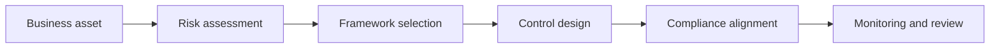

# 04 Controls, Frameworks, and Compliance

## Big picture

Controls, frameworks, and compliance are related but not interchangeable.

- Controls are the safeguards.
- Frameworks organize how security is managed.
- Compliance is the requirement to meet rules and standards.

## Control categories

| Category | Purpose | Examples |
| --- | --- | --- |
| Administrative or managerial | Govern people, policy, and process | Password policies, separation of duties, training |
| Technical | Enforce security through technology | Firewalls, IDS, antivirus, encryption |
| Physical or operational | Restrict physical access and environmental exposure | Locks, CCTV, badge readers |

## Control types

| Type | Purpose |
| --- | --- |
| Preventive | Stop an incident before it happens |
| Detective | Identify that an incident has happened or is happening |
| Corrective | Restore or recover after an incident |
| Deterrent | Discourage bad behavior or attacks |

## NIST framing

### NIST CSF

The notes emphasize the CSF as a risk-management structure. The most visible function in the exercises is Identify, but the broader model is:

- Identify
- Protect
- Detect
- Respond
- Recover

### NIST RMF

The glossary notes reference these RMF stages:

- Prepare
- Categorize
- Select
- Implement
- Assess
- Authorize
- Monitor

## Compliance and standards to know

| Standard or regulation | Main use |
| --- | --- |
| GDPR | Protects EU personal data and breach transparency |
| PCI DSS | Protects payment card processing environments |
| HIPAA | Protects health information in the US |
| FedRAMP | Standardizes US federal cloud assessment and authorization |
| FERC-NERC | Power grid and critical infrastructure obligations |
| CIS Controls | Action-oriented defensive controls |
| ISO | International standards across management and technology |
| SOC 1 and SOC 2 | Audit reporting on controls and trust areas |

## How to think about the relationship

## Botium Toys control lens

The assignment materials point to a common audit pattern:

- Identify assets first
- Compare current controls to expected controls
- Record gaps
- Map gaps to risk and business continuity impact
- Recommend prioritized remediation

## What to memorize

- Control category versus control type
- NIST CSF versus NIST RMF
- When to mention GDPR, HIPAA, and PCI DSS
- Why compliance is not the same as full security

## Quick self-test

1. Is encryption a control category or a technical control?
2. What is the difference between a preventive control and a detective control?
3. Why can an organization be compliant but still insecure?
