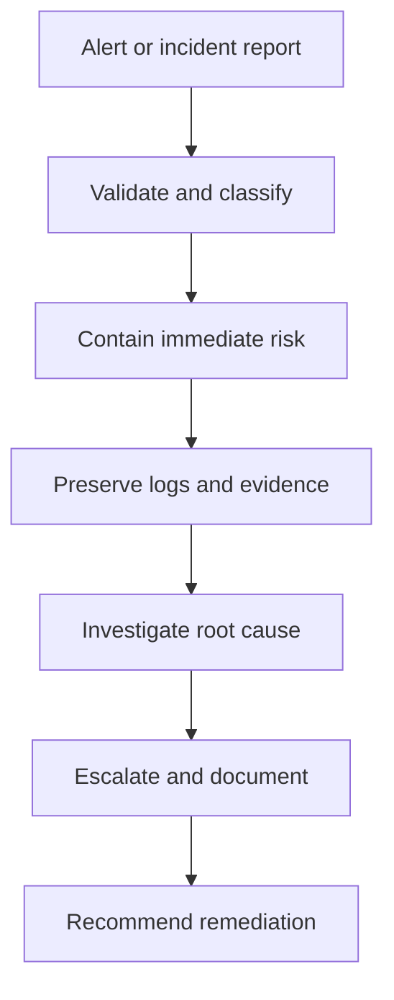

# 05 Analyst Toolkit

## Core tools from the notes

### SIEM tools

A SIEM collects and analyzes log data so analysts can monitor events, correlate signals, and investigate suspicious activity faster.

Use cases:

- Alert review
- Investigation support
- Detection tuning
- Log correlation
- Reporting and dashboards

### Intrusion detection systems

IDS tools watch activity for indicators of compromise or policy violations and generate alerts when suspicious patterns appear.

### Packet sniffers or protocol analyzers

These tools capture and inspect network traffic. They are useful for understanding protocols, spotting anomalies, and reconstructing activity.

See [12 Networking and Network Security](12-networking-and-network-security.md) for TCP/IP layers, common protocols, ports, firewalls, proxies, and VPNs.

### Playbooks

Playbooks are operational manuals for repeatable security tasks.

Common uses:

- Incident response
- Forensic handling
- Escalation steps
- Communication and documentation

### Linux command line

Linux is common in security labs, servers, logs, and tooling. Analysts use the command line to navigate files, inspect logs, filter output, manage permissions, and document repeatable steps.

Common analyst commands:

- `pwd`, `ls`, and `cd` for navigation
- `cat`, `head`, `tail`, and `less` for reading files
- `grep`, `find`, and pipes for filtering
- `ls -la` and `chmod` for permission review and changes

See [09 Linux and Permissions](09-linux-and-permissions.md) for the full walkthrough.

### SQL

SQL helps analysts query structured data in databases. It is useful for login records, device inventories, employee tables, customer records, and other tabular evidence.

Common analyst keywords:

- `SELECT` and `FROM` to choose data
- `WHERE` to filter records
- `ORDER BY` to sort results
- `JOIN` to connect related tables
- `COUNT`, `AVG`, and `SUM` to summarize results

See [10 SQL for Security Analysis](10-sql-for-security-analysis.md) for examples and SQL injection notes.

## Choosing the right tool

| Task | Tool to consider | Why |
| --- | --- | --- |
| Search a plain-text log file | Linux `grep` or SIEM search | Fast filtering of unstructured text |
| Find files by name or type | Linux `find` | Searches the file system directly |
| Query login records in a database | SQL | Filters structured rows and columns |
| Connect employees to devices | SQL `JOIN` | Combines related tables |
| Correlate alerts across many sources | SIEM | Centralized search, dashboards, and alert context |
| Inspect suspicious traffic | Packet analyzer | Shows protocol and packet-level detail |
| Evaluate allowed or blocked traffic | Firewall logs | Shows source, destination, port, protocol, and action |
| Follow a repeatable response | Playbook | Reduces improvisation and missed steps |

## Evidence handling

### Chain of custody

Chain of custody is the documented record of who had evidence, when they had it, and what they did with it.

Why it matters:

- Preserves integrity
- Supports legal and audit defensibility
- Prevents confusion and accidental contamination

### Protecting and preserving evidence

The notes emphasize working from copies and preserving volatile data first. That aligns with the order of volatility principle.

## Response workflow

## Practical habits for analysts

- Keep notes while investigating
- Preserve evidence before making changes
- Use playbooks before improvising
- Escalate when business impact or legal exposure is unclear
- Communicate findings in plain language

## What to memorize

- What SIEM, IDS, and packet sniffers do
- Why playbooks matter
- Why chain of custody exists
- Why volatile evidence must be preserved early

## Quick self-test

1. When is a SIEM more useful than manual log review?
2. Why should an analyst work from copies of evidence?
3. What does a playbook reduce during incident response?
