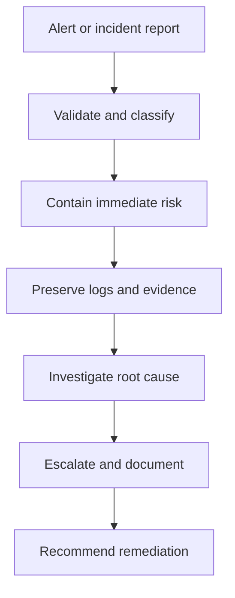

# 05 Analyst Toolkit

## Core tools from the notes

### SIEM tools

A SIEM collects and analyzes log data so analysts can monitor events, correlate signals, and investigate suspicious activity faster.

Use cases:

- Alert review
- Investigation support
- Detection tuning
- Log correlation
- Reporting and dashboards

### Intrusion detection systems

IDS tools watch activity for indicators of compromise or policy violations and generate alerts when suspicious patterns appear.

### Packet sniffers or protocol analyzers

These tools capture and inspect network traffic. They are useful for understanding protocols, spotting anomalies, and reconstructing activity.

### Playbooks

Playbooks are operational manuals for repeatable security tasks.

Common uses:

- Incident response
- Forensic handling
- Escalation steps
- Communication and documentation

## Evidence handling

### Chain of custody

Chain of custody is the documented record of who had evidence, when they had it, and what they did with it.

Why it matters:

- Preserves integrity
- Supports legal and audit defensibility
- Prevents confusion and accidental contamination

### Protecting and preserving evidence

The notes emphasize working from copies and preserving volatile data first. That aligns with the order of volatility principle.

## Response workflow

## Practical habits for analysts

- Keep notes while investigating
- Preserve evidence before making changes
- Use playbooks before improvising
- Escalate when business impact or legal exposure is unclear
- Communicate findings in plain language

## What to memorize

- What SIEM, IDS, and packet sniffers do
- Why playbooks matter
- Why chain of custody exists
- Why volatile evidence must be preserved early

## Quick self-test

1. When is a SIEM more useful than manual log review?
2. Why should an analyst work from copies of evidence?
3. What does a playbook reduce during incident response?
