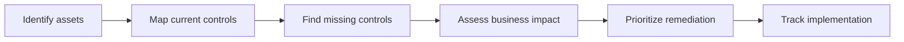

# 06 Botium Toys Case Study

## Scenario summary

Botium Toys is used in the course material as a simple audit and risk assessment exercise. The organization has a broad asset footprint but weak control maturity.

## Scope of the audit

The scope covers the full security program, including:

- Employee devices and equipment
- Internal network and internet access
- Storefront and warehouse assets
- Business systems and software
- Data storage and retention
- Legacy systems requiring manual monitoring

## Audit goal

Assess current assets and controls, then identify what should be implemented to improve security posture and compliance.

## Main risk statement

The core issue is not just one missing tool. The larger problem is inadequate asset management combined with incomplete controls and possible compliance gaps.

## Control findings from the supplied checklists

### Clearly missing or weak controls

- Least privilege
- Disaster recovery planning
- Strong password policy
- Separation of duties
- IDS coverage
- Consistent backups
- Antivirus coverage where required
- Encryption where appropriate
- Password management
- Manual support for legacy systems
- Full physical protection coverage

### Existing strengths noted in the exemplar

- A firewall is in place
- Some surveillance and physical protections exist

## How to reason about the gaps

| Gap | Risk created | Typical control response |
| --- | --- | --- |
| Broad access to customer data | Data exposure and insider misuse | Least privilege, access reviews |
| No disaster recovery plan | Prolonged outage and business interruption | Recovery playbook, backups, continuity planning |
| Weak password requirements | Easier account compromise | Password policy and password manager |
| CEO handling conflicting duties | Fraud and control failure risk | Separation of duties |
| No IDS | Delayed detection of compromise | IDS with monitoring workflow |
| Legacy systems need manual attention | Blind spots and instability | Manual monitoring plus upgrade plan |

## Recommended remediation order

1. Inventory and classify assets
2. Restrict access with least privilege
3. Establish password policy and password management
4. Implement backup and disaster recovery procedures
5. Deploy IDS and monitoring workflows
6. Formalize separation of duties
7. Improve encryption and physical security coverage
8. Create a plan for legacy system retirement or tighter monitoring

## Turning findings into a risk register

The case study becomes more useful when each finding is tracked as a risk register entry. A good entry connects the asset, the risk, the vulnerable condition, the business impact, and the next control.

| Asset or process | Risk | Why it matters | First control response |
| --- | --- | --- | --- |
| Customer data | Unauthorized access | Broad access can expose PII and payment-related information | Least privilege and access reviews |
| Business operations | Extended outage | No disaster recovery plan can make recovery slow and uncertain | Backup and recovery playbook |
| User accounts | Credential compromise | Weak passwords and no password manager increase account takeover risk | Password policy, MFA, and password manager |
| Financial processes | Fraud or unchecked decisions | Lack of separation of duties can let one person control too much | Divide responsibilities and audit approvals |
| Network monitoring | Delayed detection | Missing IDS coverage reduces visibility into suspicious activity | Deploy IDS and define alert workflow |

For more detail on inventories and risk scoring, see [11 Assets, Risk, and Threat Modeling](11-assets-risk-and-threat-modeling.md).

## A simple audit workflow

## What this case study teaches

- Asset visibility comes first
- Missing administrative controls can create major risk
- Technical controls alone are not enough
- Audit work should connect findings to business impact
- Good recommendations are prioritized, not generic

## Quick self-test

1. Why is asset inventory the first step?
2. Why is separation of duties a security issue, not just an HR issue?
3. Which control gap would you prioritize first and why?
