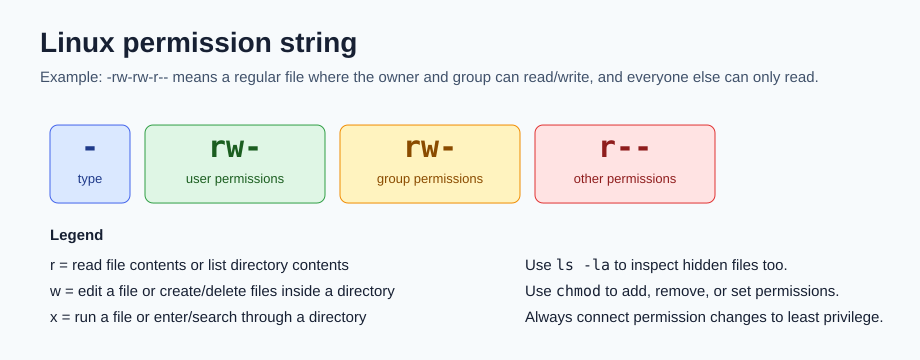
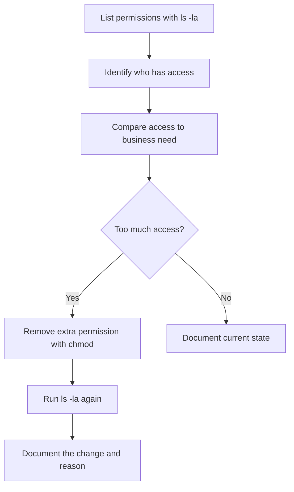

# 09 Linux and Permissions

Linux is important for cybersecurity because many servers, security tools, logs, and lab environments run on Linux. A beginner does not need to memorize every command immediately. Start by understanding how Linux is organized, how the shell receives commands, and how permissions protect files and directories.



## Where Linux fits in security work

Security analysts use Linux to:

- Navigate file systems on local or remote systems
- Inspect logs and configuration files
- Search for indicators such as usernames, IP addresses, domains, or suspicious file names
- Manage file and directory permissions
- Install and run security tools
- Follow incident response playbooks where commands must be repeatable and documented

The command-line interface is especially useful because commands can be copied, repeated, logged, and audited. That matters during investigations because the analyst must be able to explain what they did.

## Linux architecture in plain language

| Layer | Beginner meaning | Security reason to know it |
| --- | --- | --- |
| User | The person or account interacting with the system | Every action should be tied to an authorized account |
| Applications | Programs that perform tasks | Vulnerable or outdated applications can become attack paths |
| Shell | The command interpreter, such as Bash | Analysts use it to run commands and scripts |
| Filesystem Hierarchy Standard | The organized directory structure, beginning at `/` | Logs, configs, binaries, and user files live in predictable places |
| Kernel | The core of the OS that manages memory, processes, and hardware | Kernel flaws or misconfigurations can have high impact |
| Hardware | CPU, RAM, disks, and network cards | Some evidence is volatile and disappears when powered off |

## Common distributions

| Distribution | Why analysts may see it |
| --- | --- |
| Kali Linux | Security testing and training tools |
| Ubuntu | Common desktop, server, and cloud environments |
| Parrot | Security-focused Linux distribution |
| Red Hat Enterprise Linux | Enterprise server environments |
| AlmaLinux | Community enterprise Linux used as a CentOS replacement |

Different distributions often use different package managers. Debian-derived systems commonly use `apt` and `.deb` packages. Red Hat-derived systems commonly use `yum`, `dnf`, `rpm`, and `.rpm` packages.

## Navigation commands

| Command | What it does | Example |
| --- | --- | --- |
| `pwd` | Prints the current directory | `pwd` |
| `ls` | Lists files and directories | `ls` |
| `ls -l` | Lists detailed file information and permissions | `ls -l` |
| `ls -la` | Lists details, including hidden files | `ls -la` |
| `cd` | Changes directory | `cd projects` |
| `cat` | Prints a whole file | `cat auth.log` |
| `head` | Prints the first lines of a file | `head access.log` |
| `tail` | Prints the last lines of a file | `tail -n 20 access.log` |
| `less` | Opens a file for scrolling | `less system.log` |

Hidden files begin with a period, such as `.project_x.txt`. Use `ls -la` when hidden files matter.

## Filtering commands

Filtering means selecting only the data that matches a condition.

| Command or feature | Use it when |
| --- | --- |
| `grep` | You need lines that contain a string or pattern |
| `find` | You need files or directories that match criteria |
| `|` pipe | You want the output of one command to become input to another |
| `>` | You want to overwrite a file with command output |
| `>>` | You want to append command output to a file |

Examples:

```bash
grep "Failed password" auth.log
find /home/analyst/projects -name "*.txt"
cat server.log | grep "ERROR"
```

## Managing files and directories

| Command | Meaning | Caution |
| --- | --- | --- |
| `mkdir` | Create a directory | Choose names that explain purpose |
| `rmdir` | Remove an empty directory | Fails if the directory contains files |
| `touch` | Create an empty file or update timestamp | Can change evidence metadata |
| `cp` | Copy a file or directory | Prefer copies for analysis work |
| `mv` | Move or rename a file | Can make evidence harder to trace if undocumented |
| `rm` | Remove a file | Destructive; use carefully |
| `nano` | Edit a file in the terminal | Avoid editing original evidence |

For incident work, preserve originals and work from copies whenever possible.

## Permission basics

Linux permissions define who can read, write, or execute a file or directory.

Owner types:

- `u` means user, the account that owns the file
- `g` means group, the group assigned to the file
- `o` means other, everyone else

Permission types:

- `r` means read
- `w` means write
- `x` means execute
- `-` means that permission is not granted

For files:

- Read means viewing file contents.
- Write means changing file contents.
- Execute means running the file as a program or script.

For directories:

- Read means listing directory contents.
- Write means creating, renaming, or deleting entries inside the directory.
- Execute means entering the directory and accessing items inside it.

## Reading a 10-character permission string

Example:

```text
-rw-rw-r--
```

| Characters | Meaning |
| --- | --- |
| `-` | Regular file. A `d` would mean directory. |
| `rw-` | User can read and write, but not execute. |
| `rw-` | Group can read and write, but not execute. |
| `r--` | Other users can read only. |

Another example:

```text
drwx--x---
```

This is a directory. The user can read, write, and enter it. The group can enter it, but cannot list its contents. Other users have no permissions.

## Changing permissions with chmod

The `chmod` command changes file or directory permissions.

```bash
chmod o-w project_k.txt
```

This removes write permission from `other` on `project_k.txt`.

Useful patterns:

| Pattern | Meaning |
| --- | --- |
| `u+r` | Add read permission for the user |
| `g-w` | Remove write permission from the group |
| `o-x` | Remove execute permission from others |
| `u=r` | Set user permissions to read only |
| `g=r,o=` | Set group to read only and other to no permissions |

When changing multiple owner types, separate them with commas and no spaces:

```bash
chmod u-w,g-w,g+r .project_x.txt
```

## Least privilege permission workflow



## Portfolio-style example

Scenario: The `researcher2` user owns files in `/home/researcher2/projects`. The files belong to the `research_team` group. Some permissions are too broad and must be tightened.

Step 1: Inspect details.

```bash
cd projects
ls -la
```

What to look for:

- Are there hidden files?
- Which user owns each file?
- Which group owns each file?
- Does `other` have write access?
- Does a group have access it does not need?

Step 2: Remove write access from other users.

```bash
chmod o-w project_k.txt
```

Why: If `other` can write to a team file, any account outside the owner and group may be able to modify it. That breaks least privilege.

Step 3: Restrict a sensitive file.

```bash
chmod g-r project_m.txt
```

Why: If only the owner should read a restricted file, group read access should be removed.

Step 4: Handle a hidden archived file.

```bash
chmod u-w,g-w,g+r .project_x.txt
```

Why: Archived files should not be edited. The owner and group can read it, but write access is removed.

Step 5: Remove unnecessary directory access.

```bash
chmod g-x drafts
```

Why: Directory execute permission lets a user enter or traverse the directory. If only `researcher2` should access `drafts`, the group should not have execute permission.

## Common beginner mistakes

| Mistake | Why it matters | Better habit |
| --- | --- | --- |
| Forgetting hidden files | Sensitive files can be hidden with a leading period | Use `ls -la` when auditing permissions |
| Confusing file execute with directory execute | Directory `x` controls entry/search, not running a program | Interpret permissions based on file type |
| Editing evidence directly | Original evidence can be altered | Copy first, then analyze the copy |
| Giving broad group access | Group membership changes over time | Match access to a specific business need |
| Using commands without documenting why | Audits need rationale | Record command, target, result, and reason |

## What to memorize

- `pwd`, `ls`, `cd`, `cat`, `head`, `tail`, `less`
- `grep`, `find`, pipes, `>`, and `>>`
- The owner groups: user, group, other
- The permissions: read, write, execute
- How to read strings like `-rw-rw-r--`
- How `chmod` supports least privilege

## Quick self-test

1. What does the first character in `drwxr-x---` tell you?
2. Why does `ls -la` matter during a permission audit?
3. What does `chmod o-w project_k.txt` do?
4. Why can directory execute permission be sensitive?
