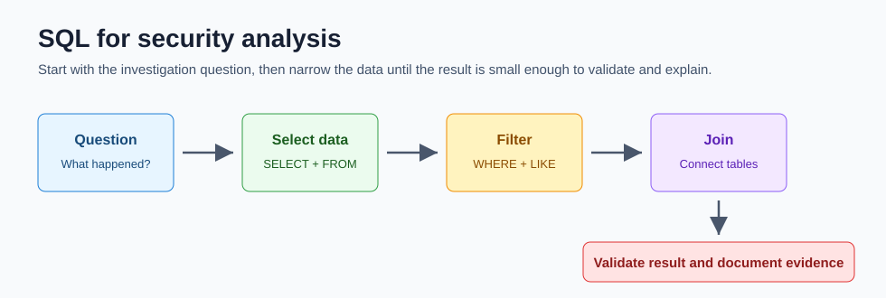

# 10 SQL for Security Analysis

SQL, or Structured Query Language, is used to create, interact with, and request information from databases. Security analysts use SQL to investigate structured records such as login attempts, devices, employees, vulnerabilities, invoices, or access events.



## SQL versus Linux filtering

Linux and SQL can both filter data, but they work best in different places.

| Question | Linux filtering | SQL filtering |
| --- | --- | --- |
| Where is the data? | Files and directories | Database tables |
| What is the structure? | Often unstructured text lines | Rows and columns |
| Common tools | `grep`, `find`, pipes | `SELECT`, `WHERE`, `JOIN` |
| Best use | Search logs, files, paths, command output | Query structured records and connect tables |
| Limitation | Harder to join related datasets | Requires the data to be in a database |

Use Linux when the evidence is a file. Use SQL when the evidence is in tables.

For hands-on Linux file filtering with realistic tutorial logs, use [16 Log Analysis Tutorial Data](16-log-analysis-tutorial-data.md).

## Database basics

| Term | Meaning |
| --- | --- |
| Database | Organized collection of information |
| Table | A set of related records |
| Row or record | One entry in a table |
| Column or field | A named attribute in each record |
| Query | A request for information |
| Primary key | A column that uniquely identifies a row |
| Foreign key | A column that connects one table to another |

Example security tables:

- `employees` might store `employee_id`, `username`, `department`, and `office`.
- `machines` might store `device_id`, `operating_system`, `OS_patch_date`, and `employee_id`.
- `log_in_attempts` might store `event_id`, `username`, `login_date`, `login_time`, `country`, and `success`.

## Basic query shape

Every beginner should first learn `SELECT` and `FROM`.

```sql
SELECT device_id, operating_system, OS_patch_date
FROM machines;
```

Read this as: "Return these columns from this table."

| Keyword | Purpose |
| --- | --- |
| `SELECT` | Chooses which columns to return |
| `FROM` | Chooses which table to query |
| `;` | Ends the SQL statement |

You can use `*` to return all columns:

```sql
SELECT *
FROM machines;
```

In real investigations, avoid `SELECT *` on large tables unless you are exploring. Smaller results are faster, safer, and easier to explain.

## Sorting results

Use `ORDER BY` to sort returned records.

```sql
SELECT customerid, city, country
FROM customers
ORDER BY city;
```

Descending order:

```sql
SELECT customerid, city, country
FROM customers
ORDER BY city DESC;
```

Multiple sort columns:

```sql
SELECT customerid, city, country
FROM customers
ORDER BY country, city;
```

This sorts by country first, then city inside each country.

## Filtering with WHERE

Use `WHERE` to return only records that meet a condition.

```sql
SELECT event_id, country
FROM log_in_attempts
WHERE country = 'USA';
```

Common operators:

| Operator | Meaning | Example |
| --- | --- | --- |
| `=` | Equal to | `WHERE country = 'USA'` |
| `<>` or `!=` | Not equal to | `WHERE country <> 'Mexico'` |
| `>` | Greater than | `WHERE login_time > '18:00:00'` |
| `>=` | Greater than or equal to | `WHERE OS_patch_date >= '2021-09-01'` |
| `<` | Less than | `WHERE date < '2023-01-31'` |
| `<=` | Less than or equal to | `WHERE date <= '2020-12-31'` |
| `BETWEEN` | Inside a number or date range | `WHERE hiredate BETWEEN '2002-01-01' AND '2003-01-01'` |

## Combining conditions

Use `AND` when both conditions must be true.

```sql
SELECT username, login_date, login_time
FROM log_in_attempts
WHERE country = 'USA'
  AND login_time > '18:00:00';
```

Use `OR` when either condition can be true.

```sql
SELECT username, country
FROM log_in_attempts
WHERE country = 'Canada'
   OR country = 'USA';
```

Use `NOT` to reverse a condition.

```sql
SELECT username, country
FROM log_in_attempts
WHERE NOT country = 'Mexico';
```

## Pattern matching with LIKE

Use `LIKE` when you need to match a text pattern.

| Pattern | Meaning |
| --- | --- |
| `'IT%'` | Starts with `IT` |
| `'%admin%'` | Contains `admin` |
| `'%a'` | Ends with `a` |
| `'N_'` | Two characters, first is `N` |
| `'a__'` | Three characters, first is `a` |

Example:

```sql
SELECT employee_id, title
FROM employees
WHERE title LIKE 'IT%';
```

## Joining tables

Security questions often need data from more than one table. A join connects tables through a shared column.

Example:

```sql
SELECT employees.employee_id,
       employees.username,
       machines.device_id,
       machines.OS_patch_date
FROM employees
INNER JOIN machines
  ON employees.employee_id = machines.employee_id;
```

Join types:

| Join | Beginner meaning | Use case |
| --- | --- | --- |
| `INNER JOIN` | Return rows where both tables match | Employees with assigned devices |
| `LEFT JOIN` | Return all rows from the first table plus matches from the second | All employees, even if a device is missing |
| `RIGHT JOIN` | Return all rows from the second table plus matches from the first | All devices, even if employee data is missing |
| `FULL OUTER JOIN` | Return all rows from both tables | Find unmatched records on both sides |

Not all database systems support every join in the same way. Check the database documentation when a join fails.

## Aggregate functions

Aggregates calculate a single summary value.

| Function | Meaning | Example |
| --- | --- | --- |
| `COUNT()` | Counts records or non-null values | `SELECT COUNT(*) FROM log_in_attempts;` |
| `AVG()` | Calculates the average | `SELECT AVG(height) FROM employees;` |
| `SUM()` | Adds numeric values | `SELECT SUM(cost) FROM purchases;` |

Example investigation question: "How many failed logins happened after business hours?"

```sql
SELECT COUNT(*) AS failed_after_hours
FROM log_in_attempts
WHERE success = 0
  AND login_time > '18:00:00';
```

## Security investigation examples

Find outdated machines:

```sql
SELECT device_id, operating_system, OS_patch_date
FROM machines
WHERE OS_patch_date < '2021-09-01'
ORDER BY OS_patch_date;
```

Find login attempts outside expected countries:

```sql
SELECT event_id, username, country, login_date, login_time
FROM log_in_attempts
WHERE NOT country = 'USA'
  AND NOT country = 'Canada'
  AND NOT country = 'Mexico';
```

Find failed attempts for one user:

```sql
SELECT event_id, username, login_date, login_time, country
FROM log_in_attempts
WHERE username = 'jsmith'
  AND success = 0
ORDER BY login_date, login_time;
```

Join users to devices for patch follow-up:

```sql
SELECT e.username,
       e.department,
       m.device_id,
       m.operating_system,
       m.OS_patch_date
FROM employees AS e
INNER JOIN machines AS m
  ON e.employee_id = m.employee_id
WHERE m.OS_patch_date < '2021-09-01'
ORDER BY m.OS_patch_date;
```

## SQL injection

SQL injection happens when an application lets user input change the meaning of a SQL query. It can allow attackers to read, modify, delete, or bypass access to data.

Common places where injection can appear:

- Login forms
- Search bars
- Comment boxes
- URL parameters
- API fields

Categories:

| Category | Meaning |
| --- | --- |
| In-band SQL injection | Attack and results use the same channel |
| Out-of-band SQL injection | Results are sent through a separate channel controlled by the attacker |
| Inferential SQL injection | Attacker infers results from behavior, timing, or errors |

Prevention:

- Use prepared statements or parameterized queries.
- Validate input against strict expectations.
- Sanitize or escape input where appropriate.
- Avoid building SQL by directly concatenating user input.
- Limit database account privileges.
- Return generic errors to users while logging details internally.

Prepared statements are the most important beginner concept because they separate code from data. User input should be treated as a value, not as part of the SQL command.

## Analyst checklist

Before running a query:

- What question am I answering?
- Which table has the evidence?
- Which columns do I need?
- What filter prevents unnecessary output?
- Do I need to join another table?

After running a query:

- Does the result size make sense?
- Are date and time filters correct?
- Did I accidentally exclude important records?
- Can I explain the query in plain language?
- Did I document the query and result?

## What to memorize

- `SELECT`, `FROM`, `WHERE`, `ORDER BY`
- `AND`, `OR`, `NOT`
- `LIKE`, `%`, and `_`
- `INNER JOIN`, `LEFT JOIN`, `RIGHT JOIN`, `FULL OUTER JOIN`
- `COUNT`, `AVG`, `SUM`
- SQL injection categories and prevention basics

## Quick self-test

1. What is the difference between `WHERE` and `ORDER BY`?
2. When should you use `LIKE` instead of `=`?
3. Why is a join useful during an investigation?
4. Why are prepared statements better than building queries from raw user input?
