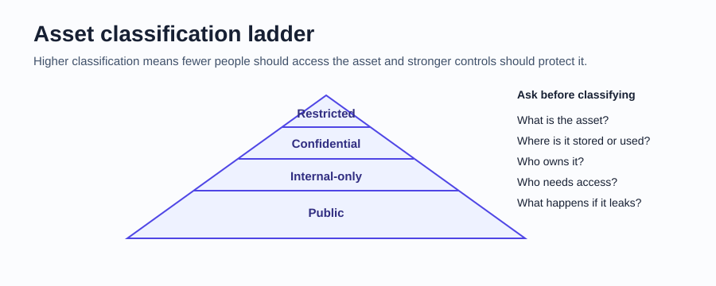
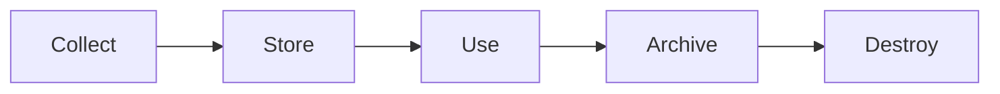
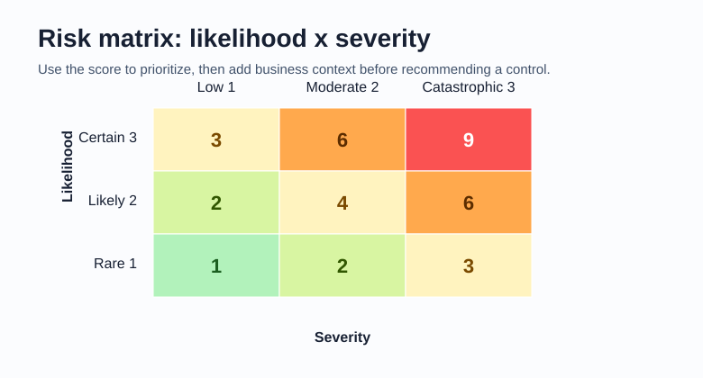
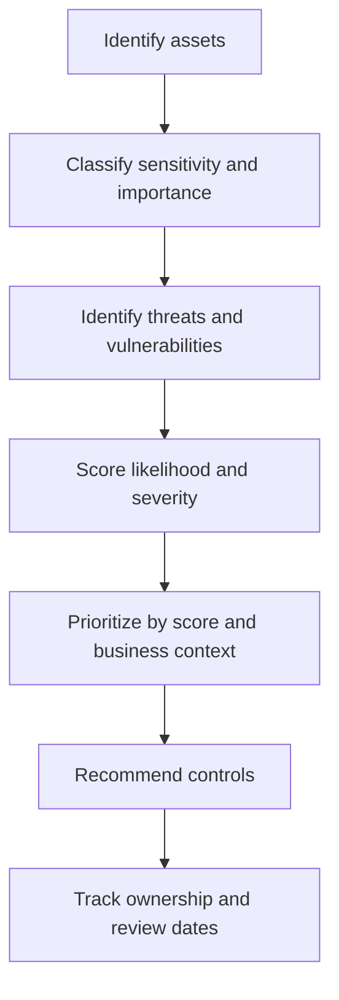
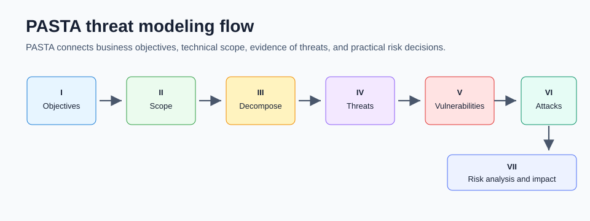
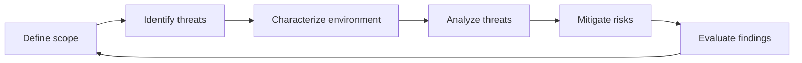

# 11 Assets, Risk, and Threat Modeling

Asset security starts with a simple idea: you can only protect what you know you have. This chapter connects asset inventories, asset classification, risk registers, data handling, vulnerability management, and threat modeling into one practical workflow.



## Core vocabulary

| Term | Meaning |
| --- | --- |
| Asset | Anything valuable that should be protected |
| Asset inventory | A catalog of assets that need protection |
| Asset classification | Labeling assets by sensitivity and importance |
| Asset management | Tracking assets and the risks that affect them |
| Threat | A circumstance or event that can negatively impact an asset |
| Vulnerability | A weakness a threat can exploit |
| Risk | Potential harm when a threat can exploit a vulnerability |
| Attack surface | All places where an attacker could try to interact with or exploit a system |
| Attack vector | The path or method used to attack |
| Security hardening | Strengthening a system to reduce vulnerability and attack surface |

## Asset inventory

An inventory records what exists, who owns it, where it is, how it connects, and how sensitive it is. A beginner-friendly inventory can start small.

| Asset | Network access | Owner | Location | Notes | Sensitivity |
| --- | --- | --- | --- | --- | --- |
| Network router | Continuous | ISP or homeowner | On-premises | Main network gateway; all devices depend on it | Confidential |
| Desktop | Occasional | Homeowner | On-premises | May contain private photos, documents, or browser sessions | Restricted |
| Guest smartphone | Occasional | Friend | On and off-premises | Connects to guest or home Wi-Fi | Internal-only |
| External hard drive | Occasional | Homeowner | On-premises | Contains media or backups | Confidential |
| Streaming media player | Continuous | Homeowner | On-premises | May store payment card details for rentals | Internal-only |
| Portable game console | Occasional | Friend | On and off-premises | Camera and microphone may create privacy risk | Internal-only |

Minimum useful inventory fields:

- Asset name
- Asset type
- Owner
- Location
- Network access
- Sensitivity
- Business or personal importance
- Notes about risk, exposure, or dependencies

## Classification levels

| Level | Meaning | Access guidance |
| --- | --- | --- |
| Restricted | Highest sensitivity; disclosure or alteration could cause serious harm | Need-to-know only |
| Confidential | Disclosure could negatively affect the organization or owner | Limited to specific users |
| Internal-only | Intended for trusted internal users or partners | Not public, but broader than confidential |
| Public | Safe for public release | Anyone can access |

Classification is not always obvious. Ask:

- What data does the asset store or process?
- Who owns the asset?
- Who needs access for a real task?
- What harm could happen if the asset is disclosed, changed, lost, or unavailable?
- Does a regulation or policy require special handling?

## Data states and lifecycle

Data is vulnerable in different ways depending on its state.

| State | Meaning | Example controls |
| --- | --- | --- |
| Data at rest | Stored and not actively moving | Encryption, access control, backups |
| Data in transit | Moving between systems | TLS, VPNs, secure protocols |
| Data in use | Being accessed or processed | Least privilege, endpoint security, monitoring |

Data lifecycle:



Each stage should have rules for who can access data, how long it is kept, how it is protected, and how it is safely destroyed.

## Data governance roles

| Role | Responsibility |
| --- | --- |
| Data owner | Decides who can access, edit, use, or destroy data |
| Data custodian | Safely stores, transports, and protects data |
| Data steward | Maintains and applies data governance policies |

In many entry-level security roles, the analyst acts like a custodian: keeping data safe, monitoring access, following policy, and escalating unusual activity.

## Privacy and security

Privacy and security overlap, but they are not identical.

| Concept | Focus |
| --- | --- |
| Information privacy | Giving people control over personal data and how it is shared |
| Information security | Protecting data in all states from unauthorized access, change, or loss |

Important data types:

- PII: personally identifiable information, such as name, address, phone number, or identifiers.
- SPII: sensitive PII with stricter handling needs, such as account numbers or credentials.
- PHI: protected health information, especially relevant under HIPAA in the United States.

## Risk formula

Risk is commonly estimated as:

```text
Likelihood x Severity = Risk priority
```

Likelihood asks: "How likely is this to happen?"

Severity asks: "How bad would the impact be?"



Use scoring to guide decisions, not to replace judgment. A risk with a lower numeric score may still need fast action if it involves legal exposure, safety, critical operations, or executive concern.

## Risk register

A risk register turns risk thinking into a tracked artifact.

| Field | What to enter |
| --- | --- |
| Asset | The asset that may be harmed, damaged, stolen, or disrupted |
| Risk | The event or scenario of concern |
| Description | The vulnerability or condition that could lead to the incident |
| Likelihood | 1 for rare, 2 for likely, 3 for certain |
| Severity | 1 for low, 2 for moderate, 3 for catastrophic |
| Priority | Likelihood multiplied by severity |
| Response | Mitigate, transfer, avoid, accept, or monitor |
| Owner | Person or team responsible for follow-up |

Example risk register:

| Asset | Risk | Description | Likelihood | Severity | Priority | First response |
| --- | --- | --- | --- | --- | --- | --- |
| Funds | Business email compromise | Employee is tricked into sharing confidential information | 2 | 2 | 4 | Email controls, MFA, training, payment verification |
| Funds | Compromised user database | Customer data is poorly encrypted | 2 | 3 | 6 | Encrypt data, restrict access, review database exposure |
| Funds | Financial records leak | Backup database server is publicly accessible | 3 | 3 | 9 | Remove public exposure, investigate access, harden cloud/storage settings |
| Funds | Theft | Physical safe is left unlocked | 1 | 3 | 3 | Lock procedure, access logs, camera review |
| Funds | Supply chain disruption | Vendor delivery delays due to natural disaster | 1 | 2 | 2 | Alternate suppliers and continuity planning |

For a fuller worksheet-style walkthrough using the Course 5 bank scenario, see [13-course-5-activities-and-portfolio.md](13-course-5-activities-and-portfolio.md).

## Risk assessment workflow



## Common risk responses

| Response | Meaning | Example |
| --- | --- | --- |
| Mitigate | Reduce likelihood or impact | Add MFA, encryption, backups, training |
| Transfer | Shift some risk to another party | Cyber insurance or managed service contract |
| Avoid | Stop the risky activity | Retire an exposed legacy system |
| Accept | Acknowledge and tolerate the risk | Low-likelihood, low-impact risk with documented approval |
| Monitor | Watch for change before acting | Track a low-risk vendor dependency |

## Least privilege and account audits

Least privilege means users and services receive only the access needed for their task.

Account types:

- Guest accounts for temporary or external access
- User accounts for employees or normal users
- Service accounts for applications and automated processes
- Privileged accounts for administrative work

Audit types:

| Audit | What it checks |
| --- | --- |
| Usage audit | What resources an account is accessing |
| Privilege audit | Whether access still matches the user's role |
| Account change audit | Whether account changes are authorized and expected |

Watch for privilege creep, where users accumulate access over time as roles change.

## Vulnerability management

Vulnerability management is the process of finding, prioritizing, fixing, and monitoring vulnerabilities.

Useful terms:

| Term | Meaning |
| --- | --- |
| CVE | Public identifier for a known vulnerability |
| CVSS | Scoring system for vulnerability severity |
| CISA KEV catalog | List of known exploited vulnerabilities observed in the wild |
| Vulnerability scanner | Tool that compares systems against known weaknesses |
| Zero-day | Vulnerability exploited before a fix is available |

Do not prioritize by CVSS alone. A lower-scored vulnerability that is actively exploited, internet-facing, or tied to a critical asset may need action before a higher-scored vulnerability on an isolated system.

## Security hardening

Hardening reduces attack surface.

Common hardening actions:

- Remove unused services and software
- Apply patches
- Enforce MFA
- Disable default accounts and default passwords
- Restrict administrative privileges
- Encrypt sensitive data
- Configure logging and alerting
- Review firewall and network rules
- Disable unnecessary ports
- Use secure baselines

## Encryption basics

| Concept | Meaning | Example |
| --- | --- | --- |
| Symmetric encryption | Same secret key encrypts and decrypts | AES |
| Asymmetric encryption | Public/private key pair | RSA, DSA |
| Hashing | One-way integrity check | Password hash verification |
| Salting | Adds random data before hashing | Stronger password storage |
| Digital certificate | Verifies the identity of a public key holder | TLS certificate |

Encryption protects confidentiality, but it must be paired with good key management, access control, and patching.

## Cloud security and shared responsibility

Cloud security protects data, applications, and infrastructure hosted through cloud services.

Cloud service models:

| Model | Customer generally manages | Provider generally manages |
| --- | --- | --- |
| SaaS | Users, settings, data handling | Application, platform, infrastructure |
| PaaS | Application code, data, identity, configuration | Runtime, platform, infrastructure |
| IaaS | OS, applications, data, identity, network configuration | Physical infrastructure and core cloud services |

Common cloud risks:

- Misconfiguration
- Overly broad identity permissions
- Exposed storage
- Poor logging
- Weak key management
- Compliance gaps

## Threat modeling

Threat modeling identifies assets, vulnerabilities, and how each is exposed to threats.



Common threat modeling questions:

- What are we building or protecting?
- What can go wrong?
- Which threats are realistic?
- Which vulnerabilities make those threats possible?
- What controls reduce likelihood or impact?
- Did the control actually address the risk?

Typical cycle:



## Common threat modeling frameworks

| Framework | What it is good for |
| --- | --- |
| STRIDE | Classifying threats as spoofing, tampering, repudiation, information disclosure, denial of service, and elevation of privilege |
| PASTA | Risk-centric modeling that connects business objectives to viable attack paths |
| Trike | Permission, privilege, and use-case centered modeling |
| VAST | Scalable threat modeling for agile and enterprise workflows |

## PASTA stages

| Stage | Focus | Beginner question |
| --- | --- | --- |
| I | Business and security objectives | Why does this application or process matter? |
| II | Technical scope | What systems, APIs, databases, users, and dependencies are involved? |
| III | Application decomposition | How does data move through the environment? |
| IV | Threat analysis | What threats apply to the scoped technologies and data? |
| V | Vulnerability analysis | Which weaknesses make those threats possible? |
| VI | Attack modeling | Which attack paths are viable? |
| VII | Risk analysis and impact | Which controls reduce the risk enough? |

Example: In a shopping application, a database search feature may introduce SQL injection risk. A useful recommendation might include prepared statements, input validation, least privilege database accounts, application logging, and incident response procedures.

For the sneaker-application PASTA worksheet, data flow diagram, and attack tree examples, see [13-course-5-activities-and-portfolio.md](13-course-5-activities-and-portfolio.md).

## What to memorize

- Asset inventory fields
- Restricted, confidential, internal-only, public
- Data at rest, in transit, and in use
- Likelihood x severity = risk priority
- Risk register fields
- CVE, CVSS, CISA KEV, vulnerability scanner, zero-day
- STRIDE and PASTA
- Shared responsibility in cloud security

## Quick self-test

1. Why is asset inventory the first step in asset security?
2. What makes restricted data different from confidential data?
3. Why should risk priority scores be reviewed with business context?
4. What is privilege creep?
5. Why does threat modeling belong in the software development lifecycle?
