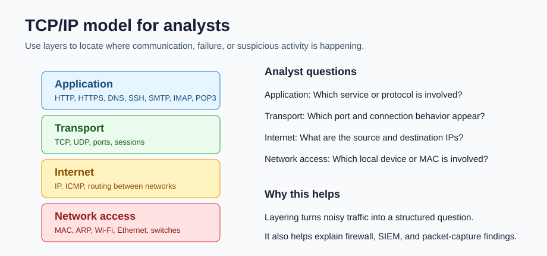
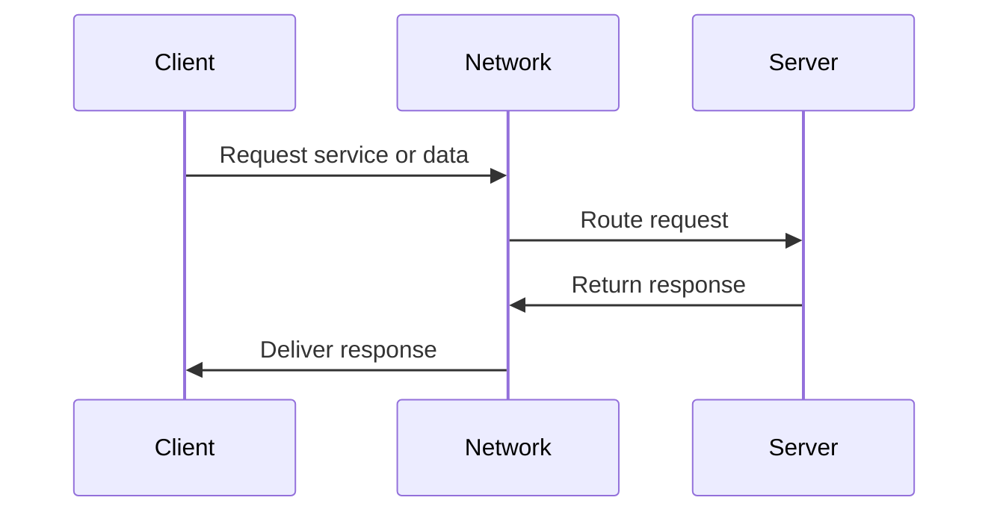
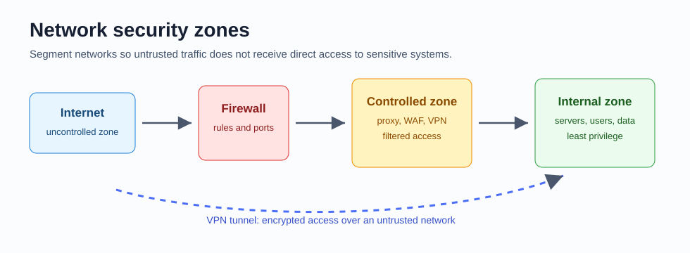
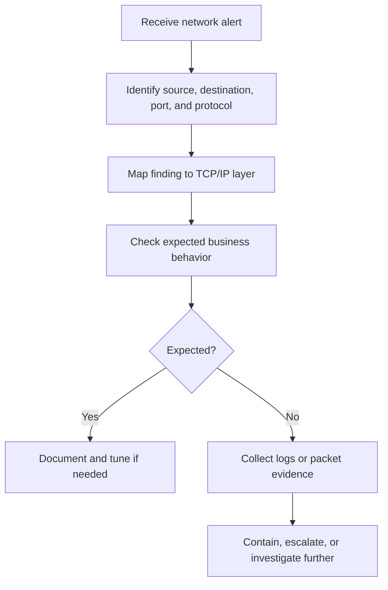

# 12 Networking and Network Security

Network security is about understanding how devices communicate, where traffic flows, and which controls reduce unsafe access. A security analyst does not need to become a network engineer on day one, but they do need enough network knowledge to read alerts, understand packet captures, discuss firewall rules, and explain why a connection is risky.

## Why networking matters to analysts

Security alerts often describe network facts:

- Source IP address
- Destination IP address
- Port number
- Protocol
- Direction of traffic
- Device name
- Username
- Allowed or blocked firewall action
- Amount of data transferred

Those facts are only useful if you can turn them into a sentence, such as: "A workstation on the internal network attempted SSH to an external IP address on TCP port 22." That sentence gives you a starting point for investigation.

## Core network devices

| Device | What it does | Security note |
| --- | --- | --- |
| Client | Requests services or information | Usually a user device like a laptop or phone |
| Server | Provides services or information | Often holds sensitive data or business functions |
| Hub | Repeats traffic to all connected ports | Less secure because traffic is easier to observe |
| Switch | Sends traffic to the correct local device using MAC addresses | Improves performance and reduces unnecessary exposure |
| Router | Connects networks and forwards packets using IP addresses | Often enforces routing and may include firewall features |
| Modem | Connects a local network to an ISP connection | Common in home and small-office networks |
| Wireless access point | Lets wireless devices connect through Wi-Fi | Must be configured with strong encryption and authentication |
| Firewall | Monitors and filters traffic | Enforces rules based on IPs, ports, protocols, applications, or state |
| Proxy server | Makes requests on behalf of clients or protects internal services | Can filter, inspect, log, and hide internal addresses |

## Client-server model

Examples:

- A browser is a client requesting a web page from a web server.
- A laptop is a client requesting a file from a file server.
- An email app is a client requesting messages from a mail server.
- A DNS resolver is a server that answers domain-to-IP lookup requests.

## MAC addresses, IP addresses, and ports

| Identifier | What it identifies | Simple analogy |
| --- | --- | --- |
| MAC address | A network interface on the local network | Device serial label for local delivery |
| IP address | A device or network location | Street address for routing |
| Port number | A service on a host | Apartment number or service desk |

Security analysts care about all three. A firewall may block a destination port, a packet capture may show a source IP, and a switch may use a MAC address table to forward local traffic.

## TCP/IP model

The TCP/IP model helps analysts organize network communication into layers.

| TCP/IP layer | What it handles | Examples | Analyst question |
| --- | --- | --- | --- |
| Application | User-facing network services | HTTP, HTTPS, DNS, SSH, SMTP, IMAP, POP3 | Which service is being used? |
| Transport | Host-to-host delivery and ports | TCP, UDP | Which port and connection behavior appear? |
| Internet | Routing between networks | IP, ICMP | What are the source and destination IPs? |
| Network access | Local network delivery | Ethernet, Wi-Fi, ARP, MAC addresses | Which local device or interface is involved? |

## TCP versus UDP

| Protocol | Plain meaning | Good for | Security clue |
| --- | --- | --- | --- |
| TCP | Connection-oriented and reliable | Web, SSH, email, file transfer | Sessions can be tracked and logged by stateful firewalls |
| UDP | Connectionless and faster | DNS, streaming, voice, gaming, DHCP | Can be abused for scanning, reflection, or flood attacks |

TCP cares about reliable delivery. UDP cares more about speed and low overhead.

## Common protocols and ports

| Protocol | Port | What it does | Security note |
| --- | --- | --- | --- |
| DHCP server | UDP 67 | Assigns IP configuration | Rogue DHCP can disrupt or redirect clients |
| DHCP client | UDP 68 | Receives IP configuration | Needed for automatic addressing |
| ARP | No port | Maps IP addresses to MAC addresses | ARP spoofing can redirect local traffic |
| DNS | UDP/TCP 53 | Translates domain names to IP addresses | DNS logs are useful for detecting suspicious domains |
| HTTP | TCP 80 | Unencrypted web traffic | Data can be read or modified in transit |
| HTTPS | TCP 443 | Encrypted web traffic | Protects content with TLS, but metadata still exists |
| SSH | TCP 22 | Secure remote shell | Often targeted by brute force attempts |
| Telnet | TCP 23 | Remote shell in clear text | Avoid because credentials are not encrypted |
| POP3 | TCP/UDP 110 | Downloads email | Unencrypted by default |
| POP3S | TCP/UDP 995 | POP3 over SSL/TLS | Encrypted mail retrieval |
| IMAP | TCP 143 | Syncs email from server | Unencrypted by default |
| IMAPS | TCP 993 | IMAP over SSL/TLS | Encrypted mail sync |
| SMTP | TCP/UDP 25 | Sends and routes email | Commonly abused for spam |
| SMTPS or submission | TCP/UDP 587 | Sends email with TLS | Preferred for authenticated mail submission |
| SFTP | TCP 22 | Secure file transfer over SSH | Safer alternative to plain FTP |
| SNMP | UDP 161/162 | Monitors and manages devices | Weak community strings can leak device data |
| ICMP | No port | Error reporting and connectivity checks | Used by `ping`; can help troubleshoot or reveal hosts |

Do not memorize ports as isolated trivia. Connect each port to what it lets someone do.

## Packet thinking

A packet contains information that helps devices deliver data.

Key fields analysts often care about:

- Source IP
- Destination IP
- Source port
- Destination port
- Protocol
- Timestamp
- Packet size
- Flags or connection state

Example interpretation:

| Observation | Possible meaning |
| --- | --- |
| Many failed connections to TCP 22 | Possible SSH brute force or scan |
| DNS lookups to strange domains | Possible malware beaconing or phishing |
| Large outbound transfer to unknown IP | Possible data exfiltration |
| Repeated ICMP failures | Possible routing or connectivity issue |
| Traffic to TCP 23 | Telnet exposure or unsafe remote access |

For hands-on packet-capture tools, filters, PCAP files, and Wireshark/tcpdump examples, continue with [14 Detection and Incident Response](14-detection-and-incident-response.md).

## NAT, DHCP, and ARP

| Protocol or process | What it does | Why it matters |
| --- | --- | --- |
| NAT | Replaces private internal IPs with a public IP for internet communication | Hides internal addressing and helps many devices share one public IP |
| DHCP | Assigns IP address, DNS server, and gateway information | Misconfiguration can break access or send clients to unsafe services |
| ARP | Maps an IP address to a MAC address on the local network | ARP poisoning can support man-in-the-middle attacks |

## Firewalls

A firewall filters traffic according to rules.

Rules may consider:

- Source IP
- Destination IP
- Source port
- Destination port
- Protocol
- Direction
- Connection state
- Application identity

Firewall categories:

| Firewall type | Meaning | Beginner example |
| --- | --- | --- |
| Stateless | Checks packets against rules without remembering connection history | Allow or block based on IP, port, and protocol |
| Stateful | Tracks connection state and allows matching return traffic | Permit outbound HTTPS and automatically allow the response |
| Next-generation firewall | Adds deeper inspection and application awareness | Block a risky app even if it uses an allowed port |
| Cloud-based firewall | Firewall delivered through cloud services | Protects cloud networks or remote users |
| Web application firewall | Filters web application traffic | Helps block common web attacks like injection attempts |

Firewalls are important, but they are not complete security by themselves. They should be combined with segmentation, least privilege, monitoring, patching, and incident response.

## Proxy servers

| Proxy type | Direction | What it protects |
| --- | --- | --- |
| Forward proxy | Internal client to external service | Users and internal network |
| Reverse proxy | External client to internal service | Internal web servers and applications |

Forward proxy example: Employees browse the internet through a proxy that blocks known malicious sites.

Reverse proxy example: Internet users access a public website through a reverse proxy, while the actual internal web server is not directly exposed.

## VPNs and encapsulation

A VPN creates an encrypted tunnel over an untrusted network. Encapsulation wraps traffic inside another packet so it can move through the tunnel.

| VPN type | Meaning | Example |
| --- | --- | --- |
| Remote access VPN | Connects one user device to an organization network | Employee laptop connects from home |
| Site-to-site VPN | Connects one network to another network | Branch office connects to headquarters |

Common VPN protocols:

| Protocol | Notes |
| --- | --- |
| IPSec | Mature and widely supported; often used for site-to-site VPNs |
| WireGuard | Newer, simpler, fast, and open source; can support remote access and site-to-site use |

VPNs encrypt data in transit, but they do not automatically make the destination safe. Users still need MFA, device health checks, logging, and least privilege.

## Wireless security

Wi-Fi lets devices connect with radio signals instead of cables.

| Protocol | Security note |
| --- | --- |
| WEP | Deprecated and unsafe |
| WPA | Older replacement for WEP |
| WPA2 | Widely used; stronger than WPA |
| WPA3 | Stronger modern option using improved protections |

Home networks usually use personal mode. Business networks often use enterprise mode, which ties Wi-Fi access to stronger identity systems.

Wireless hardening basics:

- Use WPA2 or WPA3.
- Use a strong passphrase or enterprise authentication.
- Separate guest devices from trusted internal systems.
- Disable unused management features.
- Keep router and access point firmware updated.

## Network segmentation and security zones

Segmentation divides a network into smaller parts so one compromise does not automatically expose everything.

| Zone | Meaning |
| --- | --- |
| Uncontrolled zone | Outside the organization, such as the public internet |
| Controlled zone | Filtered area between the internet and internal resources |
| Internal zone | Trusted internal systems and users |
| Subnet | Logical subdivision of a network |

Example: A public web server should not sit directly beside a payroll database with open access between them. The web server belongs in a controlled zone with tightly filtered paths to any internal data it truly needs.

## Cloud networking and SDN

Cloud service providers offer virtual networking tools such as:

- Virtual private clouds or networks
- Virtual routers
- Virtual switches
- Cloud firewalls
- Web application firewalls
- Load balancers
- VPN gateways
- IDS/IPS integrations

Software-defined networking means network behavior is controlled through software and APIs rather than only physical hardware. This is powerful because teams can change routing, segmentation, or firewall rules quickly, but it also means misconfiguration can happen quickly too.

Cloud networking benefits:

- Reliability
- Lower upfront hardware cost
- Scalability
- Faster deployment
- Automation through APIs

Cloud networking risks:

- Public exposure from misconfigured rules
- Overly broad access between segments
- Weak identity and access management
- Insufficient logging
- Confusing shared responsibility boundaries

## Analyst workflow for network alerts

## Beginner examples

### Example 1: Suspicious SSH traffic

Alert: Internal workstation connects to unknown external IP on TCP port 22.

How to think:

- TCP port 22 usually means SSH.
- SSH can be legitimate admin access, but a normal user workstation may not need it.
- Check whether the user is an administrator.
- Check timing, destination reputation, and previous activity.
- If unexpected, preserve logs and escalate.

### Example 2: DNS to strange domains

Alert: A device makes repeated DNS requests to newly observed domains.

How to think:

- DNS maps names to IP addresses.
- Malware often uses DNS to find command-and-control infrastructure.
- Compare domains to threat intelligence and user activity.
- Check the same host for suspicious processes, downloads, or login activity.

### Example 3: Firewall blocks Telnet

Alert: Firewall blocks outbound TCP port 23.

How to think:

- TCP 23 is Telnet.
- Telnet sends data in clear text and is generally unsafe.
- Determine which device attempted the connection and why.
- Recommend SSH or another secure management method.

## What to memorize

- Switches use MAC addresses; routers use IP addresses.
- TCP is connection-oriented; UDP is connectionless.
- DNS usually uses port 53.
- HTTP is port 80; HTTPS is port 443.
- SSH is port 22; Telnet is port 23.
- DHCP uses UDP 67 and 68.
- IMAP uses 143 or 993; POP3 uses 110 or 995; SMTP uses 25 or 587.
- Firewalls filter traffic; proxies broker requests; VPNs encrypt tunnels.
- Segmentation limits how far an attacker can move.

## Quick self-test

1. Why is a switch usually safer and more efficient than a hub?
2. What is the difference between an IP address and a port?
3. Why is Telnet considered unsafe?
4. What does a stateful firewall remember that a stateless firewall does not?
5. When would a reverse proxy be useful?
6. Why does segmentation reduce risk?
