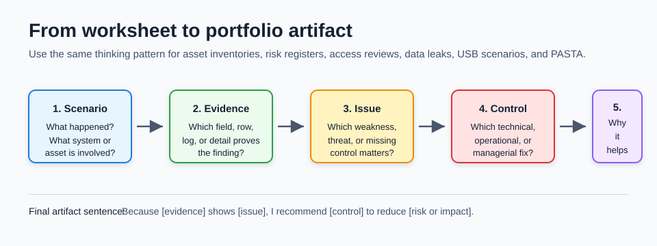
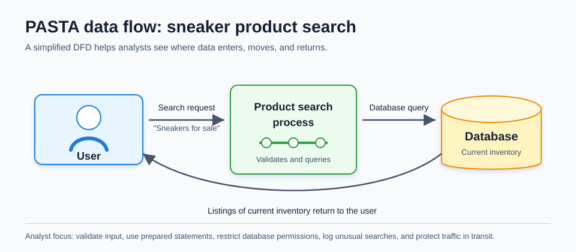
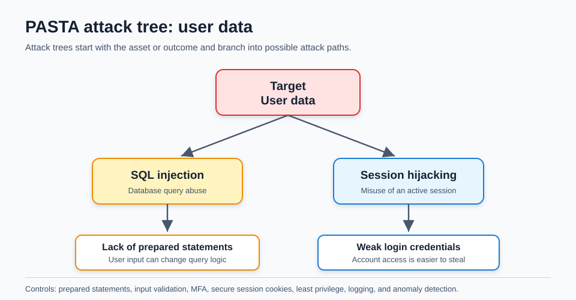

# 13 Course 5 Activities and Portfolio Practice

Course 5 turns many cybersecurity ideas into work products: asset inventories, risk registers, access-control reviews, data-leak recommendations, and threat models. This chapter explains the new activity files in plain language so a beginner can understand what each worksheet is asking for and how to turn the answer into useful portfolio evidence.

The goal is not to memorize one perfect answer. The goal is to learn a repeatable analyst method:



1. Understand the scenario.
2. Identify the asset or data at risk.
3. Find the weakness, missing control, or unsafe behavior.
4. Recommend a control that directly reduces the risk.
5. Explain why the recommendation helps.

If a worksheet feels confusing, reduce it to one sentence:

```text
Because [evidence] shows [issue], I recommend [control] to reduce [risk or impact].
```

Example:

```text
Because the payroll event IP address matches a former contractor account, I recommend disabling that account and removing unnecessary admin rights to reduce unauthorized payroll changes.
```

## Portfolio answer formula

Use this structure whenever a worksheet asks for notes, issues, recommendations, or justification.

| Part | What to write | Example starter |
| --- | --- | --- |
| Scenario | What happened or what system is being reviewed | "A former contractor account appears to still have admin access." |
| Evidence | The detail that supports your finding | "The event log IP address matches an entry in the employee directory." |
| Security issue | Why the detail matters | "A terminated account with admin access violates least privilege." |
| Recommendation | What should change | "Disable the account and remove admin rights from accounts that do not require them." |
| Justification | Why the control reduces risk | "This limits unauthorized access and reduces the blast radius if credentials are misused." |

This format makes answers clear, defensible, and easy for another person to review.

## Common beginner mistakes

| Mistake | Why it weakens the answer | Better approach |
| --- | --- | --- |
| Repeating the scenario without analysis | It does not show what risk you found | Point to a specific field, account, folder, file, asset, or behavior |
| Naming a control without justification | The reader cannot see why the control fits | Explain how the control reduces likelihood or impact |
| Confusing threat and vulnerability | The recommendation may not match the real weakness | Threat is what can happen; vulnerability is what makes it possible |
| Recommending only training | Some risks need technical or process controls too | Combine technical, operational, and managerial controls when useful |
| Ignoring business impact | The finding may feel theoretical | Explain how the issue affects data, funds, customers, operations, or compliance |

## Home asset inventory activity

An asset inventory records what needs protection. It should explain what the asset is, how it connects, who owns it, where it is, and how sensitive it is.

| Asset | Network access | Owner | Location | Notes | Sensitivity |
| --- | --- | --- | --- | --- | --- |
| Network router | Continuous | ISP | On-premises | 2.4 GHz and 5 GHz Wi-Fi are available; devices use the 5 GHz network | Confidential |
| Desktop | Occasional | Homeowner | On-premises | Contains private information, such as photos and personal files | Restricted |
| Guest smartphone | Occasional | Friend | On and off-premises | Connects to the home network when the guest is present | Internal-only |

Classification guide:

| Sensitivity | Meaning | Access rule |
| --- | --- | --- |
| Restricted | Highest sensitivity | Need-to-know only |
| Confidential | Sensitive but not the highest level | Limited to specific users |
| Internal-only | Intended for trusted internal users | Available to users on-premises or otherwise trusted |
| Public | Safe to share openly | Anyone can access |

How to think through the activity:

- A router is important because every connected device depends on it. If it is misconfigured, many other assets become easier to attack.
- A desktop can be restricted because it may store personal files, browser sessions, documents, photos, or credentials.
- A guest smartphone is not owned by the household, so it creates trust and visibility questions. It should be treated differently from trusted personal devices.

Controls that fit this activity:

- Use a strong Wi-Fi password and modern wireless security.
- Put guests on a separate guest network when possible.
- Keep router firmware updated.
- Disable unused router features.
- Back up important desktop data.
- Lock the desktop when not in use.

Portfolio-ready sentence:

> I classified the desktop as restricted because it may contain private personal information. I would protect it with strong authentication, regular backups, screen locking, and limited sharing because compromise could expose personal data.

## Risk register activity

A risk register turns risk into a table that can be tracked and prioritized. The activity scenario is a bank located in a coastal area with low crime rates, 100 on-premise employees, 20 remote employees, 2,000 individual accounts, and 200 commercial accounts. It also has marketing relationships with a professional sports team and local businesses, and it must meet strict financial requirements.

The key idea is:

```text
Likelihood x Severity = Priority
```

| Score | Likelihood meaning | Severity meaning |
| --- | --- | --- |
| 1 | Rare or low | Low impact |
| 2 | Likely or moderate | Moderate impact |
| 3 | Certain or high | Catastrophic impact |

Risk matrix:

| Likelihood \ Severity | Low 1 | Moderate 2 | Catastrophic 3 |
| --- | --- | --- | --- |
| Certain 3 | 3 | 6 | 9 |
| Likely 2 | 2 | 4 | 6 |
| Rare 1 | 1 | 2 | 3 |

Example register entries:

| Asset | Risk | Description | Likelihood | Severity | Priority | Recommended response |
| --- | --- | --- | --- | --- | --- | --- |
| Funds | Business email compromise | An employee is tricked into sharing confidential information or approving a fraudulent request | 2 | 2 | 4 | MFA, email filtering, payment verification, phishing training |
| Funds | Compromised user database | Customer data is poorly encrypted and could be exposed | 2 | 3 | 6 | Encrypt data, restrict database access, review logging and backups |
| Funds | Financial records leak | A backup database is publicly accessible | 3 | 3 | 9 | Remove public access, investigate exposure, harden storage permissions |
| Funds | Theft | A physical safe is left unlocked | 1 | 3 | 3 | Enforce lock procedure, camera coverage, physical access logs |
| Funds | Supply chain disruption | Natural disasters delay vendor delivery | 1 | 2 | 2 | Add alternate vendors and business continuity planning |

How to write a strong risk-register explanation:

- Name the asset first. The reader should know what is being protected.
- Describe the weakness, not just the bad outcome.
- Score likelihood and severity separately before multiplying.
- Add a control that matches the risk. For example, encryption helps a data exposure risk, while vendor redundancy helps a supply-chain risk.
- Do not treat the score as the only decision. A lower score can still need quick action if regulations, customer trust, or safety are involved.

## Parking lot USB exercise

The USB scenario asks you to think from three angles: what the device may contain, how an attacker could use it, and what controls should reduce the risk.

### Contents

Unknown removable media can contain normal files, sensitive files, malware, or files designed to trick a person into opening them. It may also contain personally identifiable information, business documents, credentials, scripts, or malicious software hidden behind innocent file names.

Important beginner point: personal and work files should not be mixed on the same unknown device. Mixing them makes it harder to classify the data, investigate incidents, and decide who is responsible for protecting the device.

### Attacker mindset

An attacker may leave a USB drive in a parking lot because curiosity can cause someone to plug it into a work computer. If the device contains malware, it could install a backdoor, steal credentials, copy files, or give the attacker a way into the organization's network.

In a hospital or healthcare setting, the risk can be especially serious because systems may contain protected health information, staff information, scheduling data, or access to clinical operations. Even if the USB belongs to an employee, plugging it into a work device without inspection creates unnecessary risk.

### Risk analysis and controls

| Control type | Control | Why it helps |
| --- | --- | --- |
| Technical | Disable AutoRun or automatic execution from removable media | Prevents software from running just because the device is inserted |
| Technical | Use endpoint protection and malware scanning | Detects known malicious files or behavior |
| Technical | Block unknown removable media by policy or device control | Stops untrusted USB devices from being mounted on workstations |
| Operational | Report and turn in unknown USB devices | Keeps analysts or IT in control of safe handling |
| Operational | Inspect removable media only in an isolated analysis environment | Prevents possible malware from reaching production systems |
| Managerial | Train employees not to plug in found devices | Reduces the chance of social engineering success |
| Managerial | Create a removable-media policy | Gives staff clear rules and consequences |

Portfolio-ready sentence:

> The safest response is to avoid plugging the USB drive into a work computer and report it to the security or IT team. Unknown removable media can contain malware or sensitive data, so it should be handled under policy and inspected only in an isolated environment.

## Data leak worksheet

The data leak activity describes a manufacturer where a sales manager shared an internal folder with a team during a meeting. The folder included files for an unreleased product, customer analytics, and promotional materials. The manager warned the team to wait for approval before sharing the material, but did not revoke folder access after the meeting.

Later, during a video call with a business partner, a sales representative meant to share promotional materials. Instead, the representative shared the internal folder link. The business partner assumed the link was meant for public promotion and posted it on social media.

A data leak is an unintended exposure of information. A data breach is a confirmed unauthorized access, disclosure, or compromise. A leak can become a breach if unauthorized people actually access or use the exposed information.

### What went wrong

| Issue | Why it matters |
| --- | --- |
| Overly broad folder access | People could access more than they needed |
| Access was not revoked after the meeting | Temporary access became ongoing access |
| Promotional and internal materials were stored together | The chance of sharing the wrong material increased |
| The partner received a link without clear access limits | External sharing became hard to control |
| The warning relied on memory instead of a control | People can forget instructions during real work |

### Framework mapping

The worksheet maps the problem to the NIST Cybersecurity Framework and NIST SP 800-53.

| Framework level | Worksheet mapping | Meaning |
| --- | --- | --- |
| Function | Protect | Safeguards should reduce the chance or impact of a security event |
| Category | PR.DS: Data Security | Data should be protected in storage, movement, and handling |
| Subcategory | PR.DS-5: Protections against data leaks | Controls should reduce the chance of unauthorized data disclosure |
| Control reference | NIST SP 800-53 AC-6 Least Privilege | Users should receive only the access needed for their role or task |

### Recommendations

| Recommendation | Control type | Justification |
| --- | --- | --- |
| Apply least privilege to shared folders | Technical and managerial | Users should only access files needed for their specific task |
| Use role-based access groups | Technical | Access is easier to review and remove when tied to role |
| Require expiration dates for temporary folder access | Technical | Meeting access does not remain open forever |
| Separate promotional materials from confidential product files | Operational | Reduces the chance of sharing the wrong folder |
| Use external-sharing approval for sensitive folders | Managerial | Adds review before data leaves the organization |
| Enable data labels and data loss prevention rules | Technical | Helps detect or block sharing of sensitive files |
| Log folder access and sharing activity | Detective | Supports investigation and accountability |
| Conduct regular access reviews | Managerial and operational | Finds stale, excessive, or inappropriate permissions |

Strong justification example:

> Least privilege directly addresses this incident because the sales representative did not need access to the full internal folder during the partner call. Time-limited links, role-based access, and folder separation reduce the chance that confidential product data or customer analytics will be shared outside the company.

## Access control and accounting exercise

The access-control worksheet asks you to identify authentication or authorization problems and recommend a fix. The related accounting exercise includes an event log and an employee directory.

Important event-log facts:

| Field | Value |
| --- | --- |
| Event type | Information |
| Source | AdsmEmployeeService |
| Event ID | 1227 |
| Date | 10/03/2023 |
| Time | 8:29:57 AM |
| User | Legal\Administrator |
| Computer | Up2-NoGud |
| IP address | 152.207.255.255 |
| Description | Payroll event added. FAUX_BANK |

Important employee-directory match:

| Name | Role | IP address | Employee type | Authorization | Account concern |
| --- | --- | --- | --- | --- | --- |
| Robert Taylor Jr. | Legal attorney | 152.207.255.255 | Contractor | Admin | Start date 2019-09-04, end date 2019-12-27, last access at 8:29:57 AM five days ago |

The IP address in the event log matches Robert Taylor Jr. in the employee directory. The account appears to belong to a former contractor and still has admin access. That creates both an authentication concern and an authorization concern.

| Worksheet area | Strong answer |
| --- | --- |
| Note | A payroll event was added by `Legal\Administrator` from IP `152.207.255.255`. That IP maps to Robert Taylor Jr., a contractor whose listed end date was in 2019. |
| Issue | The account appears to still be active after the contractor relationship ended. It also has admin authorization, which may be more access than the role requires. |
| Recommendation | Disable the former contractor account, remove unnecessary admin rights, review all contractor accounts, and implement automated deprovisioning tied to end dates. |
| Justification | Removing stale accounts and excessive privileges supports least privilege and reduces the chance that an old account can be misused to change payroll records. |

Additional controls:

- MFA for administrative accounts.
- Role-based access control for payroll systems.
- Account change audits for new, modified, and disabled accounts.
- Scheduled access reviews for employees, contractors, seasonal workers, and vendors.
- Alerts for privileged activity from stale or unusual accounts.
- Separation of duties so one person cannot make sensitive payroll changes without review.

Beginner tip: Do not stop at "this is suspicious." Explain exactly which field made it suspicious and which control would prevent it from happening again.

## PASTA worksheet

PASTA is a seven-stage threat modeling process. It connects business goals to technical scope, threats, vulnerabilities, attack paths, and risk decisions.



| Stage | What the worksheet asks | Beginner-friendly answer pattern |
| --- | --- | --- |
| I. Define business and security objectives | Identify business requirements that will be analyzed | The sneaker app processes product searches and may process purchases, so confidentiality, integrity, and availability matter. Customer data, payment activity, and inventory accuracy should be protected. |
| II. Define the technical scope | List important technologies and explain what to prioritize | SQL should be prioritized because product search and user data often depend on database queries. API security also matters because users interact with the application through request and response flows. |
| III. Decompose application | Show how data moves through the app | A user searches for sneakers, the product search process queries the database, and the database returns current inventory listings. |
| IV. Threat analysis | List internal and external threats | External threats include SQL injection and session hijacking. Internal threats include excessive employee access, accidental data exposure, or misuse of privileged accounts. |
| V. Vulnerability analysis | List weaknesses that could be exploited | Lack of prepared statements, weak login credentials, poor session management, excessive database permissions, or missing input validation could be exploited. |
| VI. Attack modeling | Build an attack tree | Start with the target, such as user data, then map paths like SQL injection or session hijacking. |
| VII. Risk analysis and impact | Recommend controls that reduce risk | Prepared statements, input validation, MFA, secure session cookies, least privilege database accounts, logging, and alerting reduce likelihood and impact. |

### Technical scope notes

The worksheet mentions API, PKI, AES, SHA-256, and SQL. Here is how to think about them:

| Technology | Why it matters |
| --- | --- |
| API | Defines how the app accepts requests and returns data |
| PKI | Helps establish trust using certificates and public/private keys |
| AES | Protects sensitive data through symmetric encryption |
| SHA-256 | Provides hashing for integrity checks and secure password workflows when used correctly with salting and stretching |
| SQL | Stores and queries structured data such as products, users, sessions, and transactions |

For a sneaker shopping application, SQL often deserves close attention because search, inventory, customer accounts, orders, and payment-related workflows may depend on database queries. If the application builds SQL queries unsafely, attackers may be able to read or change data they should never access.

### Data flow diagram

The supplied data flow diagram shows a simple product-search process.

1. The user searches for sneakers for sale.
2. The product search process sends a query to the database.
3. The database returns listings of current inventory.
4. The application displays the results to the user.

Security questions to ask:

- Is the search input validated?
- Are prepared statements used?
- Does the database account have only the permissions it needs?
- Are searches logged for abuse detection?
- Are errors handled safely, without leaking database details?
- Is sensitive traffic protected in transit?

## PASTA attack tree



The attack tree focuses on user data. Two example paths are shown:

| Attack path | Enabling weakness | Controls |
| --- | --- | --- |
| SQL injection | Lack of prepared statements | Prepared statements, input validation, least privilege database accounts, error handling, code review |
| Session hijacking | Weak login credentials | MFA, strong password policy, secure session cookies, short session lifetime, anomaly detection |

How to read the attack tree:

- The top item is the target the attacker wants.
- The middle items are broad attack methods.
- The lower items are weaknesses that make the attack easier.
- Controls should match the weakness. For example, prepared statements match SQL injection better than employee training alone.

## What to add to a portfolio

For each Course 5 activity, save a short summary that shows your process.

| Activity | Portfolio artifact | What it proves |
| --- | --- | --- |
| Home asset inventory | Completed asset table with sensitivity labels | You can identify assets and classify data |
| Risk register | Scored risk table with recommendations | You can prioritize risk and map controls |
| Parking lot USB | Risk analysis paragraph and controls table | You understand social engineering and removable media risk |
| Data leak worksheet | Issue, review, recommendation, justification | You can connect incidents to least privilege and NIST controls |
| Access control worksheet | Evidence-based account review | You can detect stale accounts and excessive privileges |
| PASTA worksheet | Threat model with DFD and attack tree | You can connect business objectives to attack paths and controls |

## Portfolio quality checklist

Before publishing or submitting a Course 5 artifact, check that it has:

- A clear title that names the activity.
- One short scenario summary.
- Evidence from the worksheet, log, table, or diagram.
- A specific issue, not just "this is risky."
- At least one recommended control.
- A short justification that connects the control to risk reduction.
- Plain language that a non-specialist can understand.
- No private credentials, personal data, or unnecessary raw course files.

## Quick self-test

1. Why is a former contractor account with admin access risky?
2. Which field connects the payroll event to Robert Taylor Jr.?
3. Why is temporary folder access safer when it expires automatically?
4. What is the difference between a data leak and a data breach?
5. Why should an unknown USB device be handled by IT or security instead of plugged into a work computer?
6. In the sneaker app scenario, why does SQL deserve special attention?
7. Which controls reduce SQL injection risk?
8. Which controls reduce session hijacking risk?
9. What makes a risk score of 9 more urgent than a score of 2?
10. How can a Course 5 worksheet become portfolio evidence?
