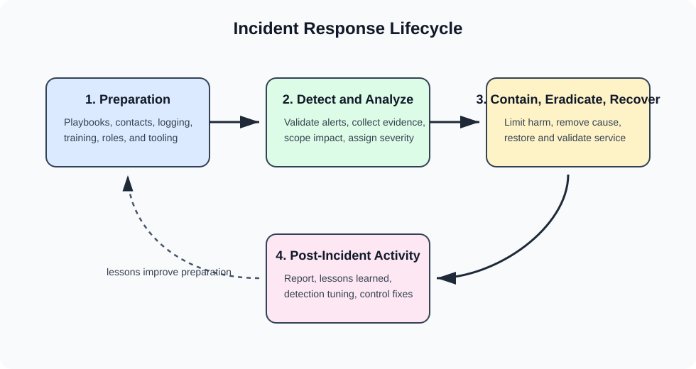
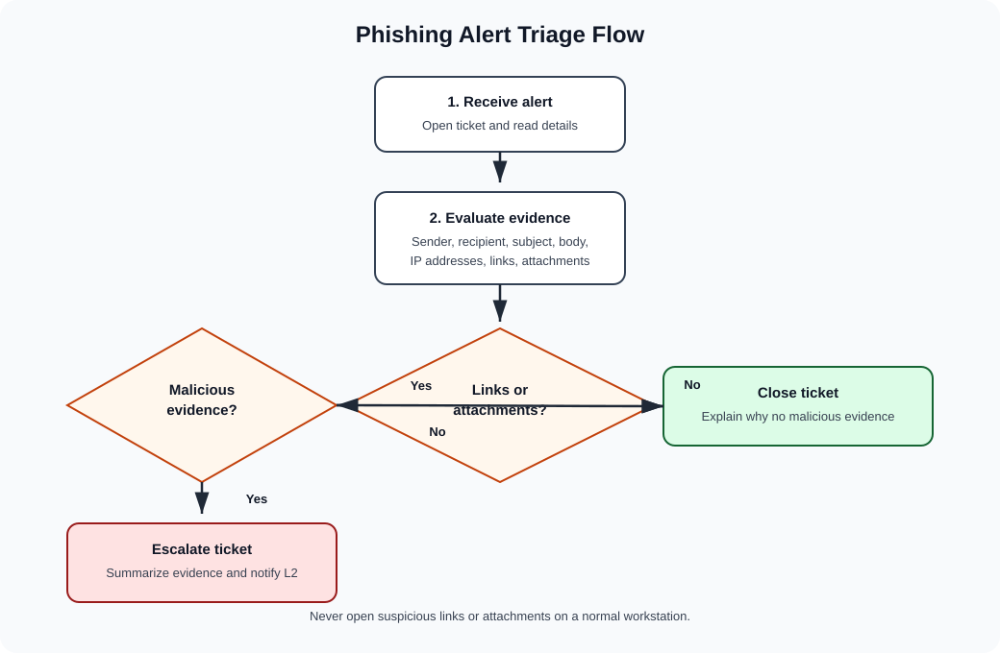
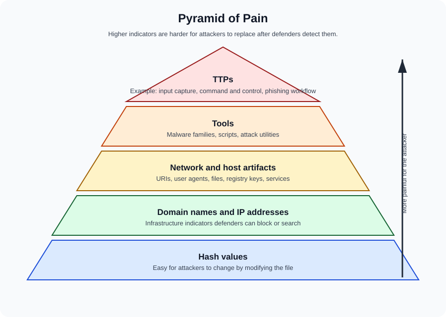
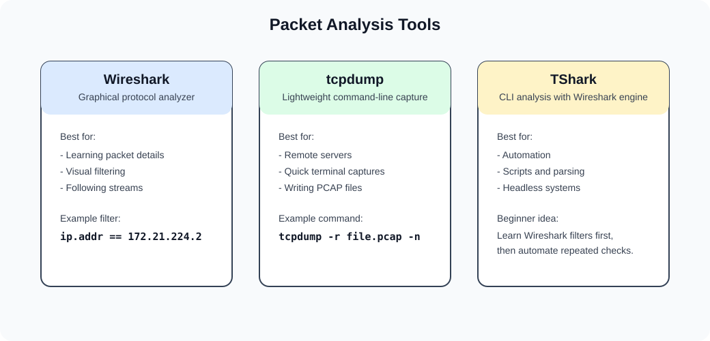
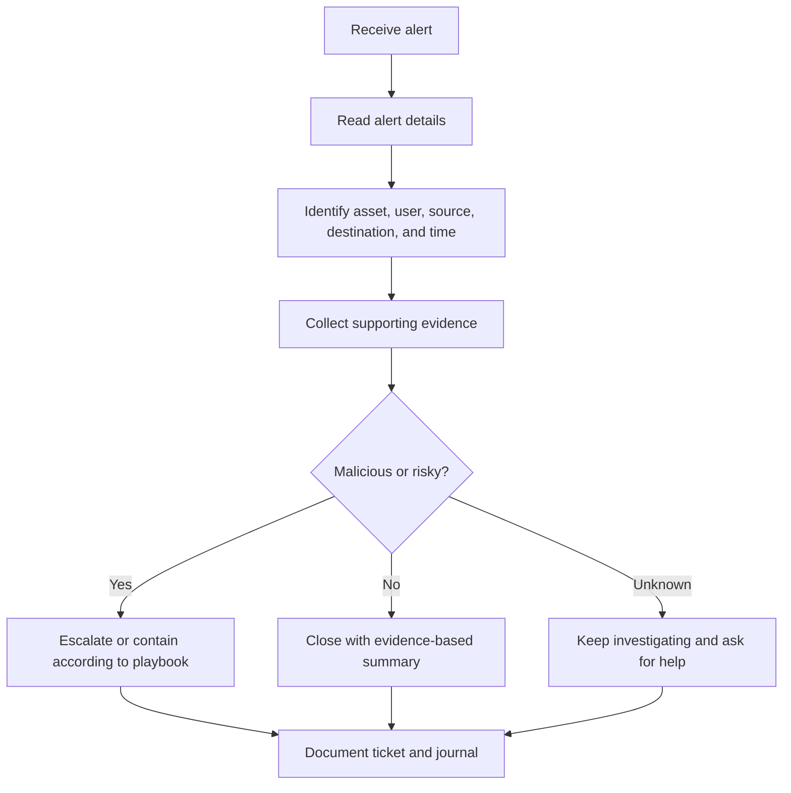
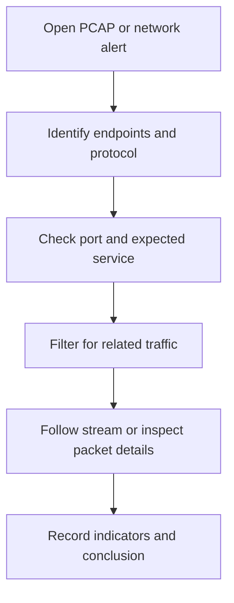

# 14 Detection and Incident Response

This chapter turns the Course 6 materials into a practical beginner guide for alert triage, incident response, packet analysis, file-hash investigation, and documentation. The goal is simple: when an alert appears, you should know what to check, what to write down, when to escalate, and how to explain the incident in plain language.

After reading this chapter, use [15 Course 6 Activities and Practice](15-course-6-activities-and-practice.md) to complete the phishing ticket, incident journal, hash investigation, packet-analysis, Suricata, and final-report activities.

## Big picture

Detection and response work answers five questions:

1. What happened?
2. Which asset, user, or business process is affected?
3. What evidence proves whether the activity is malicious?
4. What action should reduce harm now?
5. What should be documented so the team can learn from it later?

Security teams use tools such as SIEMs, IDS/IPS sensors, EDR platforms, packet analyzers, SOAR tools, and threat-intelligence sites. Tools help collect evidence, but the analyst still has to reason carefully.



## Events, alerts, and incidents

| Term | Meaning | Beginner example |
| --- | --- | --- |
| Event | Any observable activity recorded by a system | A user logs in, a file is downloaded, or a network connection is opened |
| Alert | A signal that a tool or rule marked as suspicious | A mail server flags an attachment as possible malware |
| Incident | A confirmed or likely security event that can harm confidentiality, integrity, or availability | A user opened a malicious attachment that installed malware |
| False positive | Alert says suspicious, but investigation shows it is not a real threat | A vulnerability scan from the IT team triggers an IDS alert |
| False negative | Tool misses activity that was actually malicious | Malware communicates with command and control but no alert fires |
| True positive | Alert is correct and points to real malicious activity | VirusTotal and endpoint logs confirm a malicious file |
| True negative | Normal activity is correctly ignored | Routine DNS traffic is not alerted |

The first job of triage is to decide whether the alert is a true positive, false positive, or still unknown. Do not close an alert just because it looks ordinary. Close it only after the evidence supports that decision.

## Incident response lifecycle

Many courses and frameworks describe incident response as a lifecycle. The Google notes align with the classic operational flow:

| Phase | What happens | Analyst actions |
| --- | --- | --- |
| Preparation | Get people, tools, playbooks, logging, contacts, and training ready before an incident | Learn playbooks, know escalation paths, verify logging coverage |
| Detection and analysis | Notice possible security activity, collect evidence, and decide severity | Review alerts, logs, packet captures, file hashes, affected users, and affected systems |
| Containment, eradication, and recovery | Limit damage, remove the cause, restore service, and validate normal operation | Isolate hosts, block indicators, remove malware, patch weaknesses, monitor for return activity |
| Post-incident activity | Document lessons learned and improve controls | Write final reports, update playbooks, tune detections, recommend preventive controls |

### How to think during an incident

Use this sequence when you feel stuck:

1. Identify the asset: user mailbox, endpoint, server, application, database, network segment, or business process.
2. Identify the signal: alert message, log line, packet, file hash, domain, IP address, or user report.
3. Identify the possible harm: data theft, malware execution, service outage, account compromise, or policy violation.
4. Preserve evidence before changing things.
5. Follow the playbook and escalate when impact or authority is unclear.
6. Write down what you know, what you do not know yet, and what evidence supports each conclusion.

## Response roles

Security work is team work. In a real organization, the exact titles can vary, but the responsibilities are consistent.

| Role | Main responsibility | Typical decisions |
| --- | --- | --- |
| Level 1 SOC analyst | Monitor alerts, gather first evidence, classify severity, close obvious false positives, escalate suspicious cases | Is this alert valid enough to investigate further? |
| Level 2 SOC analyst | Perform deeper investigation, connect evidence across tools, improve detections | What is the root cause and scope? |
| Level 3 analyst or SOC lead | Lead advanced investigations, threat hunting, malware analysis, and response strategy | What complex attack behavior is present? |
| Incident coordinator | Coordinate communication across security, IT, legal, PR, HR, leadership, and business teams | Who needs to know, and what can be shared? |
| Technical lead | Direct containment, eradication, recovery, patches, system changes, and validation | What technical action reduces risk fastest? |
| CSIRT | Cross-functional incident response team | How should the organization respond end to end? |

## Phishing alert triage

Phishing is a common entry point because it targets people, not just systems. A good phishing playbook keeps analysts from skipping important checks.



### Phishing triage checklist

| Check | What to look for | Why it matters |
| --- | --- | --- |
| Sender address and domain | Misspellings, strange top-level domains, newly registered domains, mismatch between display name and address | Attackers often impersonate trusted people or brands |
| Source IP | Unusual geography, hosting provider, poor reputation, previous alerts | Helps connect email activity to infrastructure |
| Recipient | Targeted role, department, or privileged user | HR, finance, IT, and executives are frequent targets |
| Subject and body | Urgency, attachment pressure, grammar errors, unusual request, credential prompt | Social engineering tries to rush the victim |
| Links | URL mismatch, shortened links, lookalike domains, credential-harvesting pages | Links can steal credentials or deliver payloads |
| Attachments | Executables, macros, archives, password-protected files, suspicious names | Attachments can install malware |
| File hash | Search by hash in approved threat-intelligence tools | Lets analysts check reputation without opening the file |
| User action | Did the user open the attachment, click the link, or enter credentials? | Determines containment urgency |

Important habit: do not open suspicious links or attachments on a normal workstation. Use approved sandboxing, detonation, or threat-intelligence processes.

### Example phishing ticket

The supplied alert-ticket activity describes a medium-severity mail-server alert involving a possible malware download. The suspicious email claimed to be about an infrastructure engineer role, targeted an HR mailbox, and included a password-protected executable attachment named `bfsvc.exe`. The ticket also provided a known malicious SHA-256 hash:

```text
54e6ea47eb04634d3e87fd7787e2136ccfbcc80ade34f246a12cf93bab527f6b
```

A beginner-friendly ticket summary could look like this:

| Field | Example analyst note |
| --- | --- |
| Alert type | Possible phishing attempt with malware attachment |
| Initial severity | Medium, because the alert suggests a user may have opened a suspicious email or attachment |
| Key evidence | Executable attachment, password-protected content, known malicious hash, unusual sender information |
| First action | Do not open the attachment. Search the hash in an approved tool and review mail gateway and endpoint logs |
| Escalation trigger | Escalate if the file is malicious, the user opened it, endpoint telemetry shows execution, or similar emails reached other users |
| Closure condition | Close only if evidence shows the attachment was not opened and reputation checks or authorized analysis show no malicious behavior |

## File-hash investigation and VirusTotal

A file hash is a fingerprint calculated from file contents. If even one byte changes, the hash changes. Hashes are useful because analysts can compare a suspicious file to known malware without running it.

Common hash types:

| Hash type | Typical length | Security note |
| --- | --- | --- |
| MD5 | 32 hex characters | Still common in malware reports, but weak for integrity assurance |
| SHA-1 | 40 hex characters | Stronger than MD5, but not preferred for modern integrity assurance |
| SHA-256 | 64 hex characters | Common modern choice for file reputation and integrity checks |

The investigation findings activity used a suspicious file hash and threat-intelligence research. The exemplar conclusion was that more than 50 vendors identified the file as malicious, the malware family was associated with Flagpro, and reporting connected it to BlackTech activity. The activity also identified these indicators and behaviors:

| Evidence type | Example from activity | How to use it |
| --- | --- | --- |
| Domain | `org.misecure.com` | Search SIEM, DNS logs, proxy logs, and EDR telemetry for connections |
| IP address | `207.148.109.242` | Check network logs and firewall logs for traffic to or from the address |
| MD5 hash | `287d612e29b71c90aa54947313810a25` | Search endpoint and file-scanning logs |
| Behavior | Command and control, HTTP requests, input capture | Map behavior to likely attacker goals and containment needs |

### Hash-investigation cautions

- Do not upload sensitive internal files to public scanning services unless policy allows it.
- Searching an existing hash is safer than uploading a file.
- A clean result does not prove a file is safe. New or modified malware may not have detections yet.
- A malicious result should be connected to local evidence before deciding scope and impact.



## Packet analysis

Packet analysis is the practice of capturing and inspecting network traffic. It helps analysts answer questions such as:

- Which systems talked to each other?
- Which protocol and port were used?
- Was the traffic expected for that service?
- Did a device connect to a suspicious domain or IP address?
- Did the payload contain readable commands, credentials, or unusual content?

### Packet structure

| Packet part | What it contains | Why analysts care |
| --- | --- | --- |
| Header | Source, destination, protocol, ports, sequence details, and routing information | Helps identify who talked to whom and how |
| Payload | The data being carried | May show commands, file content, URLs, or application messages when not encrypted |
| Footer or trailer | Error checking or end-of-frame information, depending on protocol | Helps the receiving system validate delivery |

### PCAP files

A packet capture, often called a PCAP, stores captured network traffic for later analysis. Common formats include Libpcap, WinPcap, Npcap, and PCAPng.

Only capture traffic when you are authorized. Packet captures can contain credentials, session tokens, personal data, and sensitive business information.

## Wireshark, tcpdump, and TShark



| Tool | Interface | Best for | Beginner note |
| --- | --- | --- | --- |
| Wireshark | Graphical interface | Learning protocols, following streams, filtering visually, inspecting packets in detail | Easier to explore when you are new |
| tcpdump | Command line | Lightweight capture, remote servers, quick filters, writing PCAP files | Great when you only have terminal access |
| TShark | Command line version of Wireshark-style analysis | Scripting, automation, parsing captures without a GUI | Useful after you understand Wireshark filters |

### Wireshark display-filter examples

| Goal | Example filter |
| --- | --- |
| Show DNS traffic | `dns` |
| Show traffic involving an IP | `ip.addr == 172.21.224.2` |
| Show traffic from one source IP | `ip.src == 8.8.8.8` |
| Search HTTP packet content | `http contains "moved"` |
| Match with a regular expression | `http.host matches ".*example.*"` |

Operators you should recognize:

| Operator | Meaning |
| --- | --- |
| `==` or `eq` | Equal to |
| `!=` or `ne` | Not equal to |
| `>` or `gt` | Greater than |
| `<` or `lt` | Less than |
| `>=` or `ge` | Greater than or equal to |
| `<=` or `le` | Less than or equal to |
| `contains` | Field contains a value |
| `matches` | Field matches a regular expression |

### tcpdump command pattern

Basic structure:

```bash
sudo tcpdump [-i interface] [options] [expression]
```

Common examples:

```bash
sudo tcpdump -i any -w packetcapture.pcap
sudo tcpdump -r packetcapture.pcap
sudo tcpdump -r packetcapture.pcap -v
sudo tcpdump -i any -c 3
sudo tcpdump -r packetcapture.pcap -v -n
sudo tcpdump -r packetcapture.pcap -n 'ip and port 80'
```

| Option | Meaning |
| --- | --- |
| `-i` | Choose the interface to capture from |
| `-w` | Write packets to a capture file |
| `-r` | Read packets from a capture file |
| `-v`, `-vv`, `-vvv` | Increase output detail |
| `-c` | Stop after a count of packets |
| `-n` | Do not resolve hostnames |
| `-nn` | Do not resolve hostnames or port names |

The `-n` and `-nn` options are useful during investigations because name resolution can slow output and introduce extra DNS traffic or confusing names.

## Network monitoring and indicators

An indicator of compromise is evidence that a system may already be affected. An indicator of attack is evidence that an attacker may be attempting or preparing malicious activity.

| Indicator type | Example | Where to search |
| --- | --- | --- |
| IP address | Suspicious external server | Firewall, proxy, NetFlow, SIEM |
| Domain | Known malware command-and-control domain | DNS logs, proxy logs, EDR |
| File hash | Hash of a malicious attachment | EDR, antivirus, file-scanning logs |
| Host artifact | New service, persistence key, dropped file | Endpoint telemetry, forensic tools |
| Network artifact | Unusual protocol, port, URI, user agent | Packet capture, IDS, proxy logs |
| TTP | Input capture, command and control, credential theft | Detection engineering, MITRE ATT&CK mapping |

Traffic can be suspicious when the protocol and port do not match expectations. For example, HTTPS normally uses TCP port 443. If encrypted web-like traffic appears on an unusual port, that does not prove it is malicious, but it does deserve review in context.

## SIEM, IDS, IPS, EDR, and SOAR

| Tool category | What it does | What it does not guarantee |
| --- | --- | --- |
| SIEM | Collects, normalizes, searches, correlates, and alerts on logs from many systems | It does not automatically know business context |
| IDS | Detects suspicious network or host activity and generates alerts | It usually does not block activity by itself |
| IPS | Detects and can block or reject suspicious traffic | Blocking can cause disruption if rules are poorly tuned |
| EDR | Monitors endpoint behavior, processes, files, and network activity | It may miss unmanaged or unsupported devices |
| SOAR | Automates repeatable response steps and case workflows | It still needs good playbooks, approvals, and tuning |

## Suricata basics

Suricata can operate as an IDS, IPS, and network security monitoring tool. It inspects traffic using rules and writes logs that analysts can review.

Common rule actions:

| Action | Meaning |
| --- | --- |
| `alert` | Generate an alert and allow the packet |
| `pass` | Allow traffic and stop further inspection for the matching rule |
| `drop` | Drop traffic when running inline |
| `reject` | Block traffic and send a rejection response where supported |

Common files:

| File | Purpose |
| --- | --- |
| `suricata.yaml` | Main configuration file |
| `fast.log` | Human-readable alert summary |
| `eve.json` | Structured JSON event output, useful for SIEM ingestion and `jq` parsing |

Example commands:

```bash
sudo suricata -r sample.pcap -S custom.rules -k none
cat /var/log/suricata/fast.log
cat /var/log/suricata/eve.json
jq . /var/log/suricata/eve.json | less
jq -c '[.timestamp,.flow_id,.alert.signature,.proto,.dest_ip]' /var/log/suricata/eve.json
jq 'select(.flow_id==123456789)' /var/log/suricata/eve.json
```

## Incident handler's journal

An incident handler's journal is a simple investigation notebook. It helps you preserve your thinking while the investigation is still active.

Use it to record:

- Date and entry number
- Short description of the activity
- Tools used
- The 5 W's: who, what, when, where, and why
- Additional notes, questions, and next steps

### Journal example

The supplied journal exemplar describes a ransomware incident at a healthcare organization. A beginner-friendly entry might look like this:

| Field | Example entry |
| --- | --- |
| Date | July 23, 2024 |
| Entry | 1 |
| Description | Documented a ransomware incident affecting a healthcare clinic |
| Tools used | None during initial write-up |
| Who | Organized unethical hacking group |
| What | Ransomware encrypted critical files and disrupted operations |
| When | Tuesday morning around 9:00 a.m. |
| Where | A healthcare company or clinic |
| Why | Attackers likely used phishing to install malware and demand payment |
| Additional notes | Review phishing controls, backups, user training, endpoint protection, and whether ransom-payment decisions require legal or executive involvement |

The journal is not a final report. It is an investigation record. Keep it factual, timestamped, and clear enough that another analyst could understand your reasoning.

## Final report

After an incident, a final report turns investigation notes into a clear business and technical record.

Typical sections:

| Section | What to include |
| --- | --- |
| Executive summary | Plain-language summary of what happened and business impact |
| Timeline | Key events, detection time, response actions, containment, recovery |
| Investigation findings | Evidence, affected assets, root cause, indicators, and scope |
| Actions taken | Containment, eradication, recovery, communication, monitoring |
| Recommendations | Control improvements, detection tuning, training, process updates |
| Lessons learned | What worked, what failed, and what should change before the next incident |

## Mini workflows

### Alert triage workflow



### Packet investigation workflow



## What to memorize

- Difference between event, alert, and incident
- True positive, true negative, false positive, and false negative
- The incident response lifecycle phases
- What L1, L2, L3, incident coordinator, and technical lead roles do
- Why phishing triage checks sender, recipient, links, attachments, hash, and user action
- Why analysts search file hashes instead of opening suspicious files
- When to use Wireshark, tcpdump, and TShark
- What SIEM, IDS, IPS, EDR, and SOAR each contribute
- Why journals, tickets, and final reports all matter

## Practice next

Use [15 Course 6 Activities and Practice](15-course-6-activities-and-practice.md) for:

- Blank phishing-ticket and journal templates
- Worked answers for the supplied alert-ticket and ransomware-journal scenarios
- Hash-investigation and Pyramid of Pain practice
- Wireshark, tcpdump, PCAP, and Suricata exercises
- A phishing-to-incident capstone package

## Quick self-test

1. What is the difference between an alert and an incident?
2. Why can a false negative be more dangerous than a false positive?
3. What evidence would you collect before escalating a phishing email with an executable attachment?
4. Why should suspicious attachments not be opened on a normal workstation?
5. When would tcpdump be a better first tool than Wireshark?
6. What does a file hash help an analyst check?
7. What should be included in an incident handler's journal entry?
8. What should a final report explain that a journal entry may not?
