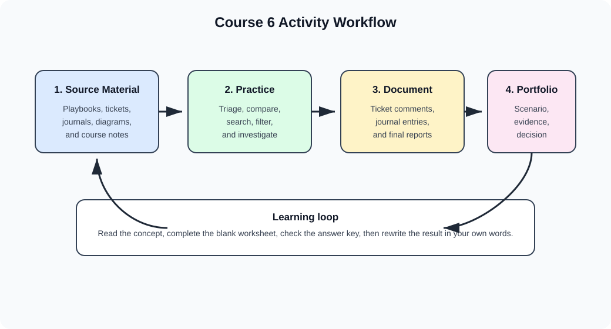

# 15 Course 6 Activities and Practice

This chapter turns the supplied Course 6 files into practice activities. It is written for a new learner who needs to understand the concept, complete the activity, and then explain the result in a portfolio or interview.

The activities are paraphrased learning exercises based on the source files. They are not raw copies of the course files.



## Source-to-practice map

| Source material | Main concept | Practice activity in this chapter |
| --- | --- | --- |
| `googlenotes.md` Course 6 notes | Detection, response, SOC work, packet analysis, SIEM, IDS/IPS, EDR, SOAR, Suricata, reporting | Activity 1, Activity 7, Activity 8, capstone |
| Phishing incident response playbook | Repeatable phishing triage and escalation decisions | Activity 2 |
| Alert-ticket file | Realistic phishing alert details and ticket fields | Activity 3 |
| Incident handler journal template | Structured investigation note-taking | Activity 4 |
| Incident handler journal exemplar | Worked ransomware journal entry | Activity 4 answer key |
| Investigation findings deck | Hash reputation, malware indicators, Pyramid of Pain | Activity 5 |
| Wireshark/tcpdump diagram template and exemplar | Comparing packet-analysis tools | Activity 6 |
| Google Cybersecurity glossary | Course 6 vocabulary | Activity 9 |

## How to use these activities

1. Read [14 Detection and Incident Response](14-detection-and-incident-response.md) first.
2. Complete the blank activity before reading the answer key.
3. Write short answers in your own words.
4. Explain every decision with evidence.
5. Treat each activity as a small portfolio artifact: scenario, evidence, decision, action, and lesson learned.

For extra command-line log practice, complete [16 Log Analysis Tutorial Data](16-log-analysis-tutorial-data.md) after Activity 8.

## Activity 1: Course 6 concept map

### Goal

Connect the major Course 6 topics so they feel like one workflow instead of separate vocabulary lists.

### Instructions

Fill in the table with your own explanation and one example.

| Topic | What it means | One beginner example |
| --- | --- | --- |
| Detection |  |  |
| Alert triage |  |  |
| Incident response |  |  |
| Evidence preservation |  |  |
| Packet analysis |  |  |
| File-hash investigation |  |  |
| SIEM search |  |  |
| IDS/IPS alerting |  |  |
| Endpoint investigation |  |  |
| Final reporting |  |  |

### Answer key

| Topic | Study answer |
| --- | --- |
| Detection | Noticing activity that may be suspicious, risky, or policy-violating |
| Alert triage | Reviewing evidence to decide whether an alert is malicious, benign, or needs escalation |
| Incident response | Organized process for limiting harm, investigating cause, restoring service, and improving defenses |
| Evidence preservation | Protecting logs, files, captures, notes, and timelines from loss or accidental change |
| Packet analysis | Inspecting network traffic to understand systems, protocols, ports, payloads, and behavior |
| File-hash investigation | Using a file fingerprint to compare suspicious files against known reputation data |
| SIEM search | Searching centralized logs to find related activity across systems |
| IDS/IPS alerting | Detecting suspicious traffic; IPS may also block or reject traffic |
| Endpoint investigation | Reviewing activity on a device, such as processes, files, network connections, or malware behavior |
| Final reporting | Summarizing what happened, business impact, evidence, actions, recommendations, and lessons learned |

## Activity 2: Phishing playbook decision flow

### Scenario

A level-one SOC analyst receives a phishing alert. The playbook says to review the alert, inspect email details, check whether the email has links or attachments, evaluate reputation safely, and either close or escalate the ticket.

### Blank worksheet

| Step | Your notes |
| --- | --- |
| What alert was received? |  |
| Who received the email? |  |
| Who sent the email? |  |
| Does the email contain links? |  |
| Does the email contain attachments? |  |
| What makes the message suspicious? |  |
| What tools or logs should be checked? |  |
| Should the ticket be closed or escalated? |  |
| What evidence supports that decision? |  |

### Decision guide

| Evidence | Recommended action |
| --- | --- |
| No link, no attachment, no suspicious indicators | Close with a short evidence-based note |
| Link or attachment exists, but reputation and authorized analysis show no malicious behavior | Close with supporting evidence |
| Malicious link, malicious hash, executable attachment, credential-harvesting page, or user interaction | Escalate to L2 or incident response |
| Unsure whether the artifact is safe | Do not open it on a normal workstation; keep investigating or escalate |

### Answer key

A good answer should mention that phishing triage is not only about the email text. The analyst should review the sender, recipient, source IP, subject, body, links, attachments, file hash, and any user action. If malicious evidence is confirmed or the user opened the attachment, escalation is appropriate.

## Activity 3: Complete an alert ticket

### Scenario facts

Use the supplied alert-ticket scenario:

| Field | Scenario detail |
| --- | --- |
| Ticket ID | `A-2703` |
| Alert message | `SERVER-MAIL Phishing attempt possible download of malware` |
| Severity | Medium |
| Recipient | HR mailbox at `inergy.com` |
| Sender theme | Applicant message about an infrastructure engineer role |
| Attachment | Password-protected executable named `bfsvc.exe` |
| Password in message | `paradise10789` |
| Known malicious SHA-256 | `54e6ea47eb04634d3e87fd7787e2136ccfbcc80ade34f246a12cf93bab527f6b` |

### Blank ticket update

| Ticket field | Your update |
| --- | --- |
| Ticket status |  |
| Severity after triage |  |
| Key evidence |  |
| User risk |  |
| Recommended next action |  |
| Ticket comments |  |

### Strong answer

| Ticket field | Example update |
| --- | --- |
| Ticket status | Escalated |
| Severity after triage | Medium, with potential to become high if endpoint execution is confirmed |
| Key evidence | Executable attachment, password-protected file, known malicious SHA-256 hash, suspicious sender details, HR recipient |
| User risk | HR users often receive resumes, so the lure is believable; if opened, malware execution is possible |
| Recommended next action | Escalate to L2, search mail logs for other recipients, check endpoint telemetry for file download or execution, block hash and sender indicators where approved |
| Ticket comments | The email includes a password-protected executable attachment and a hash already identified as malicious. Do not open the attachment on a normal workstation. Escalating for endpoint and mail-scope investigation. |

### What makes this a good ticket note

- It states the decision clearly.
- It names the evidence.
- It does not exaggerate beyond the evidence.
- It tells the next analyst what to check next.

## Activity 4: Incident handler's journal

### Goal

Practice recording investigation notes in a way another analyst can understand later.

### Blank journal template

| Field | Entry |
| --- | --- |
| Date |  |
| Entry number |  |
| Description |  |
| Tools used |  |
| Who |  |
| What |  |
| When |  |
| Where |  |
| Why |  |
| Evidence |  |
| Questions |  |
| Next steps |  |

### Scenario: healthcare ransomware

A healthcare clinic experienced a ransomware incident on a Tuesday morning around 9:00 a.m. Employees could not access critical files, including medical records. A ransom note appeared. The suspected initial access method was a targeted phishing email with a malicious attachment. The malware installed ransomware that encrypted important files and disrupted business operations.

### Strong journal entry

| Field | Example entry |
| --- | --- |
| Date | July 23, 2024 |
| Entry number | 1 |
| Description | Initial journal entry for healthcare ransomware incident |
| Tools used | None during the initial written summary |
| Who | Organized unethical hacking group, based on the scenario |
| What | Ransomware encrypted critical files and prevented staff from accessing medical records |
| When | Tuesday morning around 9:00 a.m. |
| Where | Healthcare clinic systems |
| Why | Likely financial motive, based on ransom note; suspected initial access through phishing attachment |
| Evidence | Employee access issues, ransom note, suspected phishing email, encrypted critical files |
| Questions | Were backups available? Which users received the phishing email? Did any endpoint logs show malware execution? Was patient care affected? |
| Next steps | Preserve logs, isolate affected systems, review email and endpoint evidence, notify incident response stakeholders, begin recovery planning |

### Reflection questions

1. What facts are confirmed?
2. What facts are assumptions?
3. What evidence should be preserved first?
4. Who should receive an escalation or status update?
5. What control could reduce this risk next time?

## Activity 5: Hash investigation and Pyramid of Pain

### Scenario

An investigation findings deck reports that a suspicious hash was identified as malicious by many security vendors. The malware is associated with Flagpro, and reporting connects it to BlackTech activity. The activity also identifies a domain, IP address, file hash, and behaviors.

### Evidence table

| Evidence | Value or behavior |
| --- | --- |
| Domain | `org.misecure.com` |
| IP address | `207.148.109.242` |
| MD5 hash | `287d612e29b71c90aa54947313810a25` |
| Behaviors | Command and control, HTTP requests, input capture |
| Malware context | Flagpro |
| Threat context | BlackTech activity reporting |

### Blank worksheet

| Question | Your answer |
| --- | --- |
| Has the hash been reported as malicious? |  |
| What evidence supports your answer? |  |
| Which indicators should be searched in local logs? |  |
| Which indicator is easiest for an attacker to change? |  |
| Which indicator is hardest for an attacker to change? |  |
| What should you avoid doing with sensitive files? |  |

### Answer key

| Question | Study answer |
| --- | --- |
| Has the hash been reported as malicious? | Yes, the activity indicates many vendors reported it as malicious |
| What evidence supports your answer? | Vendor detections, malware-family context, threat-actor reporting, and related indicators |
| Which indicators should be searched in local logs? | Domain, IP address, MD5 hash, HTTP requests, command-and-control behavior, input-capture signs |
| Which indicator is easiest for an attacker to change? | File hash, because small file changes create a new hash |
| Which indicator is hardest for an attacker to change? | TTPs, because changing behavior, process, and tooling is more costly |
| What should you avoid doing with sensitive files? | Avoid uploading internal files to public scanning services unless policy authorizes it |

### Local-search plan

| Data source | What to search |
| --- | --- |
| DNS logs | `org.misecure.com` |
| Proxy logs | Domain, URL paths, HTTP user agent, repeated outbound requests |
| Firewall logs | `207.148.109.242` and unusual outbound connections |
| EDR | File hash, process execution, child processes, persistence, network connections |
| SIEM | Correlate domain, IP, file hash, endpoint, user, and time range |

## Activity 6: Wireshark and tcpdump comparison

### Goal

Understand when each packet-analysis tool is useful.

### Blank comparison

| Feature | Wireshark | tcpdump | Similarity |
| --- | --- | --- | --- |
| Interface |  |  |  |
| System resources |  |  |  |
| Filtering |  |  |  |
| Best beginner use |  |  |  |
| Best remote-server use |  |  |  |

### Answer key

| Feature | Wireshark | tcpdump | Similarity |
| --- | --- | --- | --- |
| Interface | Graphical interface | Command-line interface | Both inspect network traffic |
| System resources | Uses more resources | Lightweight | Both can help analyze packet captures |
| Filtering | Advanced display filters and coloring | Capture and read filters from the terminal | Both support filtering for specific traffic |
| Best beginner use | Exploring packet details visually | Learning compact capture commands | Both build protocol understanding |
| Best remote-server use | Less convenient if no GUI is available | Strong fit for terminal-only systems | Both can support incident investigations |

### Practice commands

Explain what each command does:

```bash
sudo tcpdump -i any -w packetcapture.pcap
sudo tcpdump -r packetcapture.pcap -n
sudo tcpdump -r packetcapture.pcap -n 'ip and port 80'
```

Expected explanations:

| Command | Meaning |
| --- | --- |
| `sudo tcpdump -i any -w packetcapture.pcap` | Capture traffic from any interface and write it to a PCAP file |
| `sudo tcpdump -r packetcapture.pcap -n` | Read a capture file without resolving hostnames |
| `sudo tcpdump -r packetcapture.pcap -n 'ip and port 80'` | Read IP traffic involving port 80 without hostname resolution |

## Activity 7: Packet-capture investigation

### Scenario

You receive a PCAP from a suspicious network alert. You need to determine whether the traffic is expected or risky.

### Worksheet

| Investigation step | Your notes |
| --- | --- |
| What time range does the capture cover? |  |
| Which internal IPs appear? |  |
| Which external IPs or domains appear? |  |
| Which protocols are present? |  |
| Which ports are present? |  |
| Is the protocol expected for the port? |  |
| Is traffic one-time, repeated, or beacon-like? |  |
| Is payload readable or encrypted? |  |
| What filter helped most? |  |
| What is your conclusion? |  |

### Useful Wireshark filters

| Goal | Filter |
| --- | --- |
| DNS traffic | `dns` |
| One IP address | `ip.addr == 172.21.224.2` |
| One source IP | `ip.src == 8.8.8.8` |
| HTTP content search | `http contains "moved"` |
| HTTP host pattern | `http.host matches ".*example.*"` |

### Good conclusion pattern

Use this structure:

```text
The traffic appears [benign/suspicious/unknown] because [evidence].
The key indicators are [IP/domain/port/protocol/timestamp].
Recommended next step: [close, continue monitoring, search SIEM, escalate, contain].
```

## Activity 8: Suricata alert review

### Goal

Practice reading structured alert output and deciding what to search next.

### Concepts to know

| Item | Meaning |
| --- | --- |
| `suricata.yaml` | Main configuration file |
| `fast.log` | Quick human-readable alert summary |
| `eve.json` | Structured JSON event log used for parsing and SIEM ingestion |
| `alert` | Rule action that records a detection |
| `drop` | Rule action that blocks traffic when Suricata runs inline |
| `reject` | Rule action that blocks and sends a rejection response when supported |

### Practice prompt

Suppose a Suricata alert shows:

```json
{
  "timestamp": "2026-05-11T09:30:14Z",
  "src_ip": "10.10.4.23",
  "dest_ip": "207.148.109.242",
  "proto": "TCP",
  "alert": {
    "signature": "Possible command and control traffic",
    "severity": 2
  }
}
```

Complete the worksheet:

| Question | Your answer |
| --- | --- |
| Which internal host should be investigated? |  |
| Which external indicator should be searched? |  |
| What kind of behavior might this represent? |  |
| Which logs should be searched next? |  |
| Should this be closed immediately? Why or why not? |  |

### Answer key

| Question | Study answer |
| --- | --- |
| Which internal host should be investigated? | `10.10.4.23` |
| Which external indicator should be searched? | `207.148.109.242` |
| What kind of behavior might this represent? | Possible command-and-control traffic |
| Which logs should be searched next? | SIEM, firewall, proxy, DNS, EDR, authentication logs, and any related packet captures |
| Should this be closed immediately? Why or why not? | No. It should be validated with related evidence because command-and-control traffic can indicate compromise |

## Activity 9: Vocabulary drill

Write one sentence for each term. Your sentence should include an example or analyst action.

| Term | Your sentence |
| --- | --- |
| Event |  |
| Alert |  |
| Incident |  |
| True positive |  |
| False positive |  |
| False negative |  |
| Indicator of compromise |  |
| Indicator of attack |  |
| File hash |  |
| PCAP |  |
| TTP |  |
| SOAR |  |
| EDR |  |
| Incident handler's journal |  |
| Final report |  |

### Example answers

| Term | Example sentence |
| --- | --- |
| Event | A login event records that a user accessed a system at a specific time |
| Alert | A malware alert tells an analyst that a file or behavior matched a detection rule |
| Incident | A ransomware infection is an incident because it affects availability and business operations |
| True positive | A true positive occurs when an alert correctly identifies malicious activity |
| False positive | A false positive occurs when an alert appears suspicious but is explained by authorized activity |
| False negative | A false negative occurs when malicious activity happens without an alert |
| Indicator of compromise | A known malicious file hash can be an indicator of compromise |
| Indicator of attack | Repeated credential-guessing attempts can be an indicator of attack |
| File hash | A file hash helps compare a suspicious file to known malware without opening it |
| PCAP | A PCAP stores captured network packets for later analysis |
| TTP | A TTP describes attacker behavior, such as command and control or input capture |
| SOAR | SOAR can automate repeatable response steps such as ticket enrichment |
| EDR | EDR helps investigate endpoint processes, files, and network connections |
| Incident handler's journal | An incident handler's journal records actions, evidence, and questions during an investigation |
| Final report | A final report explains what happened, what was done, and how to improve |

## Capstone: phishing-to-incident workflow

### Scenario

An HR employee receives an email about a job application. The email contains a password-protected executable attachment. A mail alert identifies a possible malware download. A known malicious hash is available. Network evidence later shows traffic to a suspicious external IP.

### Your task

Create a complete mini incident package:

1. Alert-ticket update
2. Phishing triage decision
3. Hash investigation summary
4. Packet or network search plan
5. Incident handler journal entry
6. Final report outline
7. Recommended controls

### Recommended controls to consider

| Control | Why it helps |
| --- | --- |
| Email attachment filtering | Blocks risky file types before users receive them |
| Safe attachment detonation | Analyzes attachments in an isolated environment |
| Security awareness training | Helps users recognize suspicious lures |
| EDR blocking by hash or behavior | Detects and contains suspicious endpoint activity |
| DNS or proxy blocking | Prevents access to known malicious domains or IPs |
| Least privilege | Reduces impact if one account or endpoint is compromised |
| Backups and recovery testing | Helps restore service after ransomware |
| Playbook improvement | Makes future response faster and more consistent |

### Capstone answer outline

```text
Alert decision:
Escalate because the email contains a password-protected executable and a known malicious hash.

Evidence:
Suspicious sender, HR recipient, executable attachment, password in body, malicious SHA-256, possible network traffic to suspicious IP.

Immediate actions:
Do not open the attachment. Preserve the email and logs. Search for other recipients. Check endpoint telemetry. Search firewall, DNS, proxy, and SIEM logs. Escalate to L2 or incident response.

Journal summary:
Document who received the email, what happened, when it was detected, where evidence was found, why it is suspicious, what tools were used, and what questions remain.

Final report outline:
Summarize impact, timeline, evidence, containment, recovery, and recommended controls.
```

## Portfolio tips

- Keep each activity short enough for someone to read quickly.
- Include screenshots only if they show your own lab work or allowed course output.
- Explain your reasoning, not just the final answer.
- Use tables for evidence, decisions, and next steps.
- Never include private data, real credentials, or sensitive files in a public portfolio.
