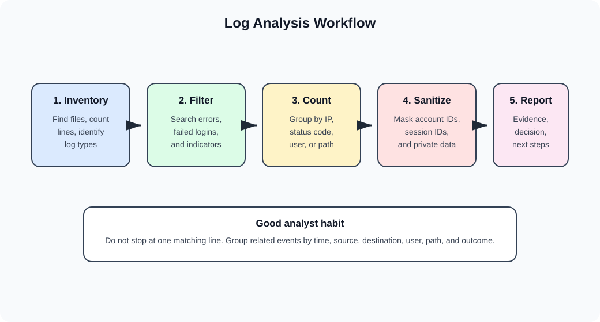

# 16 Log Analysis Tutorial Data

This chapter turns the supplied `tutorialdata.zip` archive into beginner-friendly log-analysis practice. The archive contains server and sales logs that are useful for learning Linux filtering, incident triage, and evidence documentation.

The raw archive is treated as source material. The public study guide uses summaries, safe examples, and exercises instead of publishing the full raw log files, because logs can contain session identifiers, account-like numbers, IP addresses, and other sensitive fields.



## What the archive contains

| Folder | File | Approximate line count | What it represents |
| --- | --- | ---: | --- |
| `www1` | `access.log` | 13,628 | Web access requests for web server 1 |
| `www1` | `secure.log` | 10,593 | SSH, `su`, and authentication-related events for web server 1 |
| `www2` | `access.log` | 12,912 | Web access requests for web server 2 |
| `www2` | `secure.log` | 9,683 | SSH, `su`, and authentication-related events for web server 2 |
| `www3` | `access.log` | 12,992 | Web access requests for web server 3 |
| `www3` | `secure.log` | 9,983 | SSH, `su`, and authentication-related events for web server 3 |
| `mailsv` | `secure.log` | 9,829 | SSH and authentication-related events for a mail server |
| `vendor_sales` | `vendor_sales.log` | 30,244 | Vendor transaction-style records with vendor IDs, codes, and account identifiers |

## Why this data is useful

These logs help you practice common analyst tasks:

- Finding files and understanding directory structure
- Reading log line formats
- Searching for failed logins
- Identifying repeated source IP addresses
- Counting HTTP status codes
- Looking for suspicious web requests
- Handling account or session identifiers carefully
- Writing a short investigation summary from evidence

## Safety and privacy rules

Treat logs as sensitive by default.

| Data type | Why it matters | Safe handling habit |
| --- | --- | --- |
| IP addresses | Can identify systems, users, or third-party infrastructure | Share only what is needed for the investigation |
| Session IDs | Can sometimes be used to track or hijack user activity | Mask or remove before publishing examples |
| Account identifiers | May resemble payment, customer, or internal account data | Do not publish full values in public notes |
| Usernames | Can reveal employees, services, or targets | Share only when needed for security work |
| Timestamps | Help build timelines | Keep them when they support the investigation |

Use masked examples in public writeups:

```text
VendorID=5037 Code=C AcctID=<masked-account-id>
GET /product.screen?productId=<product-id>&JSESSIONID=<masked-session-id>
```

## Log types in the archive

### Web access logs

The `www1`, `www2`, and `www3` folders contain `access.log` files. These logs record web requests.

Common fields:

| Field | Meaning | Analyst question |
| --- | --- | --- |
| Source IP | Client that made the request | Is this IP expected or repeated unusually often? |
| Timestamp | When the request happened | Does it align with an alert or incident timeline? |
| HTTP method | `GET`, `POST`, or another method | Is the request reading data or changing state? |
| URI/path | Requested resource | Is the request targeting login, cart, admin, error, or old endpoints? |
| Status code | Server response such as `200`, `404`, or `503` | Are there many errors or blocked requests? |
| Referrer | Previous page or source | Does the navigation flow make sense? |
| User agent | Browser, bot, or client string | Is the client normal, old, scripted, or pretending to be a bot? |

Status-code counts from the sample:

| File | Notable status counts |
| --- | --- |
| `www1/access.log` | `200:11835`, `400:233`, `404:244`, `406:258`, `408:267`, `500:225`, `503:324`, `505:242` |
| `www2/access.log` | `200:11186`, `400:257`, `403:228`, `404:209`, `406:228`, `408:243`, `500:262`, `503:299` |
| `www3/access.log` | `200:11261`, `400:211`, `404:237`, `406:224`, `408:246`, `500:246`, `503:329`, `505:238` |

Beginner interpretation:

- `200` means the request was successful.
- `400` range responses often mean the request was bad, forbidden, missing, or not acceptable.
- `500` range responses often mean server-side errors.
- A few errors can be normal; repeated errors from the same source, path, or time range deserve review.

### Secure logs

The `secure.log` files record authentication-related activity.

Common patterns:

| Pattern | Meaning |
| --- | --- |
| `Failed password` | Login attempt failed |
| `invalid user` | Login attempt used an account name that does not exist |
| `sshd` | SSH daemon handled the event |
| `pam_unix` | Linux authentication/session module recorded the event |
| `session opened` | A session started |
| `session closed` | A session ended |
| `su` | User attempted to switch user context |

Observed failed-password counts:

| File | Failed password lines | Invalid user lines | Session opened lines |
| --- | ---: | ---: | ---: |
| `mailsv/secure.log` | 8,154 | 5,872 | 519 |
| `www1/secure.log` | 8,798 | 6,355 | 536 |
| `www2/secure.log` | 8,034 | 5,802 | 492 |
| `www3/secure.log` | 8,267 | 5,982 | 555 |

Beginner interpretation:

- Many failed passwords may indicate scanning, brute-force attempts, password spraying, or noisy internet exposure.
- `invalid user` often suggests automated guessing of common usernames.
- Successful sessions should be reviewed in context. A successful session after many failed attempts is more interesting than an isolated failed login.

### Vendor sales logs

The `vendor_sales.log` file contains records with a timestamp, vendor ID, code, and account identifier.

Generic format:

```text
[timestamp] VendorID=<id> Code=<letter> AcctID=<masked-account-id>
```

Code counts from the sample:

| Code | Count |
| --- | ---: |
| A | 1,908 |
| B | 2,945 |
| C | 1,908 |
| D | 2,942 |
| E | 1,967 |
| F | 2,702 |
| G | 1,403 |
| H | 2,055 |
| I | 2,091 |
| J | 1,489 |
| K | 1,047 |
| L | 3,148 |
| M | 2,008 |
| N | 2,631 |

Beginner interpretation:

- A code distribution helps identify normal volume and outliers.
- Account identifiers should be protected, masked, or excluded from public notes.
- If one vendor or code suddenly spikes, that may be worth investigating.

## Linux commands to practice

These examples assume the archive has been extracted into a folder named `tutorialdata`.

### Inventory the data

```bash
find tutorialdata -type f
wc -l tutorialdata/*/*.log
du -h tutorialdata/*/*.log
```

What this teaches:

- `find` locates files.
- `wc -l` counts lines.
- `du -h` shows file sizes in human-readable format.

### Search authentication failures

```bash
grep "Failed password" tutorialdata/*/secure.log
grep "invalid user" tutorialdata/*/secure.log
grep "session opened" tutorialdata/*/secure.log
```

What this teaches:

- Failed logins are not automatically incidents, but they can become evidence.
- Invalid usernames are often a sign of automated guessing.
- Successful sessions should be checked against expected administrator activity.

### Count repeated source IP addresses

```bash
grep "Failed password" tutorialdata/*/secure.log \
  | grep -oE 'from ([0-9]{1,3}\.){3}[0-9]{1,3}' \
  | awk '{print $2}' \
  | sort \
  | uniq -c \
  | sort -nr \
  | head
```

What this teaches:

- `grep -oE` extracts only the matching part of the line.
- `sort | uniq -c` counts repeated values.
- Repeated IPs can help scope scanning or brute-force behavior.

### Search web errors

```bash
grep ' 404 ' tutorialdata/www*/access.log
grep ' 500 ' tutorialdata/www*/access.log
grep ' 503 ' tutorialdata/www*/access.log
```

What this teaches:

- `404` can show probing for missing pages.
- `500` and `503` can show server errors or availability problems.
- One error is not enough. Look for repeated patterns by IP, path, user agent, and time.

### Review shopping-cart and error paths

```bash
grep 'cart.do' tutorialdata/www*/access.log
grep 'CreditDoesNotMatch' tutorialdata/www*/access.log
grep 'oldlink' tutorialdata/www*/access.log
```

What this teaches:

- Application paths tell a story about user behavior.
- Repeated errors during purchase flows may point to fraud, testing, broken logic, or normal failed transactions.
- Old endpoints may be harmless redirects or legacy paths, but attackers also probe old paths.

### Count vendor codes without exposing account IDs

```bash
grep -oE 'Code=[A-Z]' tutorialdata/vendor_sales/vendor_sales.log \
  | sort \
  | uniq -c \
  | sort -nr
```

What this teaches:

- You can analyze patterns without printing sensitive account identifiers.
- Counting categorical values is a useful first step before deeper investigation.

### Mask account IDs before sharing examples

```bash
sed -E 's/AcctID=[0-9]+/AcctID=<masked-account-id>/g' tutorialdata/vendor_sales/vendor_sales.log | head
```

What this teaches:

- Analysts should reduce sensitive exposure when writing public notes.
- Sanitized examples are safer for study guides and portfolios.

## Activity 1: Build a log inventory

Fill in the table after extracting the archive.

| Folder | Log file | What system does it represent? | What questions can it answer? |
| --- | --- | --- | --- |
| `www1` | `access.log` |  |  |
| `www1` | `secure.log` |  |  |
| `www2` | `access.log` |  |  |
| `www2` | `secure.log` |  |  |
| `www3` | `access.log` |  |  |
| `www3` | `secure.log` |  |  |
| `mailsv` | `secure.log` |  |  |
| `vendor_sales` | `vendor_sales.log` |  |  |

Answer guide:

- Web access logs answer questions about HTTP requests, status codes, user agents, paths, and source IP addresses.
- Secure logs answer questions about SSH logins, failed passwords, invalid users, and sessions.
- Vendor sales logs answer questions about vendor activity and transaction-code patterns.

## Activity 2: Investigate SSH failures

### Task

Use the secure logs to find repeated failed login attempts.

| Question | Your answer |
| --- | --- |
| Which files contain `Failed password`? |  |
| Which source IP appears most often? |  |
| Which invalid usernames appear? |  |
| Are there successful sessions near the same time? |  |
| Should this be closed, monitored, or escalated? |  |

### Strong answer pattern

```text
The secure logs show repeated failed SSH login attempts across multiple servers.
The evidence includes many "Failed password" and "invalid user" entries.
This should be investigated further by checking whether any successful sessions occurred near the same time, whether the source IP is expected, and whether firewall or SSH hardening controls are in place.
```

## Activity 3: Analyze web access errors

### Task

Use the web access logs to review error status codes.

| Question | Your answer |
| --- | --- |
| Which server has the most `503` responses? |  |
| Which paths appear near error responses? |  |
| Which source IPs appear repeatedly? |  |
| Are the errors tied to one endpoint or many endpoints? |  |
| What is the next investigation step? |  |

### Strong answer pattern

```text
The access logs include repeated 400-level and 500-level responses.
The next step is to group errors by source IP, path, timestamp, and user agent.
Repeated errors against old or unusual paths may indicate probing, while repeated server errors may indicate availability or application issues.
```

## Activity 4: Protect sensitive fields

### Task

Review the vendor sales log without publishing account identifiers.

| Question | Your answer |
| --- | --- |
| Which fields are safe to summarize? |  |
| Which fields should be masked? |  |
| Which code has the highest count? |  |
| Which code has the lowest count? |  |
| How would you share findings safely? |  |

### Answer guide

- Safe to summarize: counts, trends, code totals, vendor totals, and time ranges.
- Mask before sharing: full account identifiers.
- In this sample, code `L` has the highest count and code `K` has the lowest count.

## Activity 5: Write an analyst summary

Use this template after completing the log checks:

```text
Scope:
Reviewed tutorial web access logs, secure authentication logs, and vendor sales logs.

Key evidence:
- Authentication logs contain repeated failed SSH login attempts and invalid usernames.
- Web access logs contain successful requests plus 400-level and 500-level errors.
- Vendor sales records contain code values and account identifiers that must be masked before sharing.

Conclusion:
[Benign / suspicious / needs more investigation] because [evidence].

Next steps:
[Search related logs, check successful sessions, review firewall or SSH controls, group web errors, mask sensitive fields, document findings.]
```

## Portfolio version

For a public portfolio, do not upload the raw archive or full logs. Instead, show:

- The directory structure
- A small sanitized sample
- Commands used
- Counts and trends
- Your conclusion
- A note explaining how you protected sensitive fields

## What to memorize

- `access.log` shows web requests.
- `secure.log` shows authentication-related events.
- `grep` finds matching lines.
- `sort | uniq -c` counts repeated values.
- HTTP `400` range codes usually mean client-side request issues.
- HTTP `500` range codes usually mean server-side problems.
- Logs can contain sensitive fields, so sanitize before sharing publicly.

## Quick self-test

1. Why should raw logs be treated as sensitive?
2. What does `Failed password for invalid user` suggest?
3. Why is a successful session after many failed logins worth reviewing?
4. What is the difference between `404` and `503`?
5. Why should account identifiers be masked in public notes?
6. What command pattern counts repeated values in a log?
