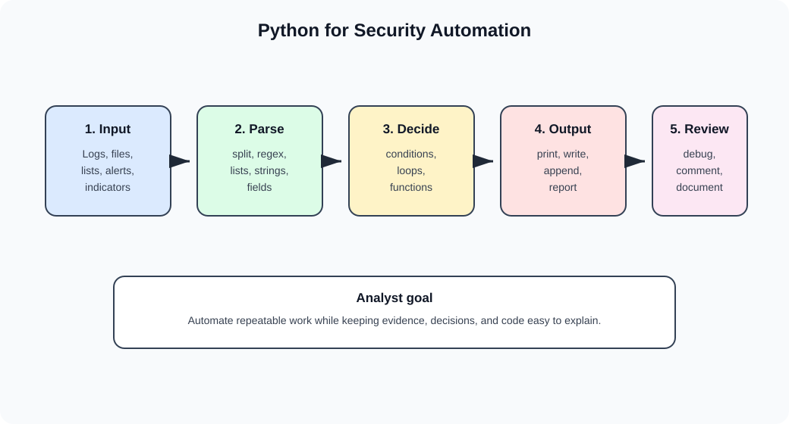
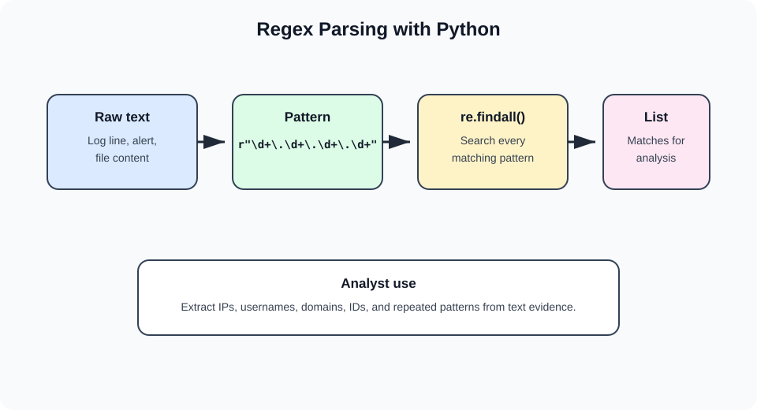
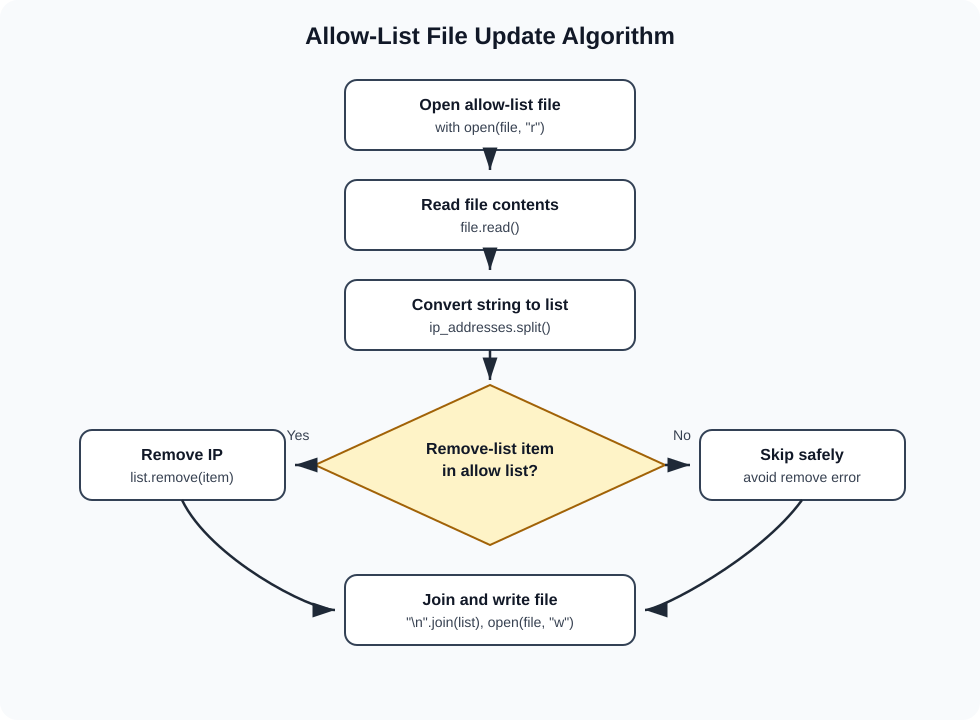

# 17 Python for Security Automation

This chapter turns the Course 7 Python materials into beginner-friendly notes for cybersecurity learners. The goal is not to become a software engineer overnight. The goal is to understand enough Python to automate repetitive analyst tasks, parse security data, update files safely, and explain code clearly.

Use this chapter with [18 Course 7 Python Activities](18-course-7-python-activities.md) for hands-on practice.



## Why Python matters in cybersecurity

Security analysts often repeat the same work:

- Search logs for suspicious strings
- Count failed login attempts
- Compare users against an allow list
- Extract IP addresses, domains, usernames, or timestamps
- Clean data before writing a report
- Update files after access changes
- Convert raw text into a usable list

Python is useful because it can turn those repeatable steps into clear instructions that a computer can run the same way every time.

## Python environments

| Environment | What it is | Best beginner use |
| --- | --- | --- |
| Notebook | Browser-based coding workspace with code cells and markdown cells | Learning, labs, and explaining code beside output |
| IDE | Code editor with tools for writing, running, and checking code | Larger scripts and repeated projects |
| Command line | Text interface for running Python files and commands | Running scripts during investigations or automation work |

Notebook cells matter in Course 7:

| Cell type | Purpose |
| --- | --- |
| Code cell | Holds Python code that can be run |
| Markdown cell | Holds explanations, headings, notes, and instructions |

When sharing work, include code and results. Do not include screenshots of unrelated lab directions unless the assignment specifically asks for them.

## Data types

Data types tell Python what kind of value it is working with.

| Data type | Meaning | Example | Security use |
| --- | --- | --- | --- |
| String | Text inside quotes | `"failed login"` | Usernames, IP addresses, log lines, file paths |
| Integer | Whole number | `5` | Login-attempt counts, status codes |
| Float | Decimal number | `3.14` | Percentages, averages, scores |
| Boolean | `True` or `False` | `is_allowed = True` | Access decision, condition result |
| List | Ordered collection | `["alice", "bob"]` | Users, IPs, alerts, log entries |
| Tuple | Ordered collection that should not change | `("ssh", 22)` | Fixed protocol-port pairs |
| Dictionary | Key-value collection | `{"user": "alice"}` | Parsed event fields |
| Set | Unordered unique collection | `{"10.0.0.1", "10.0.0.2"}` | Deduplicated indicators |

### Choosing a data type

| Question | Good type |
| --- | --- |
| Do I need text? | String |
| Do I need a count? | Integer |
| Do I need true-or-false logic? | Boolean |
| Do I need an ordered group that can change? | List |
| Do I need unique values only? | Set |
| Do I need named fields? | Dictionary |

## Variables

A variable stores a value so you can use it later.

```python
username = "bmoreno"
login_attempts = 4
is_approved = True
```

Good variable names help other analysts understand your intent.

| Rule | Good example | Avoid |
| --- | --- | --- |
| Use descriptive names | `failed_attempts` | `x` |
| Use lowercase with underscores | `approved_users` | `ApprovedUsers` |
| Do not use Python keywords | `status_code` | `if` |
| Remember case sensitivity | `user_name` | Mixing `User_Name` and `user_name` |

## Conditional statements

Conditional statements let Python choose what to do based on evidence.

```python
status = 200

if status == 200:
    print("Request succeeded")
elif status >= 500:
    print("Server error")
else:
    print("Review status")
```

| Keyword or operator | Meaning | Security example |
| --- | --- | --- |
| `if` | Start a condition | If a user is in the allow list, permit access |
| `elif` | Check another condition after earlier conditions fail | If status is `500`, review server error |
| `else` | Run when no previous condition is true | Otherwise, document and review |
| `and` | Both sides must be true | Username matches and attempts are under limit |
| `or` | At least one side must be true | Status is `100` or `102` |
| `not` | Reverse a condition | User is not removed |
| `in` | Check membership | IP is in approved IP list |

## Iterative statements

Loops repeat instructions. Analysts use loops to process each log line, username, IP address, or file entry.

### `for` loop

Use a `for` loop when you have a sequence.

```python
approved_users = ["bmoreno", "tshah", "elarson"]

for user in approved_users:
    print(user)
```

### `while` loop

Use a `while` loop when repetition depends on a condition.

```python
login_attempts = 0

while login_attempts < 5:
    login_attempts = login_attempts + 1
```

| Keyword | Meaning |
| --- | --- |
| `for` | Repeat over a known sequence |
| `while` | Repeat while a condition remains true |
| `break` | Exit a loop early |
| `continue` | Skip the rest of the current loop and continue with the next iteration |
| Loop variable | Temporary variable that stores the current item |

## Functions

Functions package repeatable work into reusable code.

```python
def calculate_fail_percentage(total_attempts, failed_attempts):
    fail_percentage = failed_attempts / total_attempts
    return fail_percentage
```

| Term | Meaning |
| --- | --- |
| Function | Reusable section of code |
| User-defined function | Function written by the programmer |
| Built-in function | Function that already exists in Python |
| Parameter | Name used in the function definition |
| Argument | Value passed into the function call |
| Return statement | Sends information back from the function |

### Parameters vs. arguments

```python
def greet_user(username):        # username is a parameter
    return "Hello " + username

message = greet_user("bmoreno")  # "bmoreno" is an argument
```

### Local and global variables

| Variable type | Where it is available | Good habit |
| --- | --- | --- |
| Local variable | Inside the function where it is created | Prefer for function-specific work |
| Global variable | Across the program | Use carefully to avoid confusing side effects |

## Built-in functions

| Function | What it does | Example security use |
| --- | --- | --- |
| `print()` | Outputs information | Show result while testing |
| `type()` | Shows data type | Confirm whether a value is a string, integer, list, etc. |
| `range()` | Generates a number sequence | Loop a set number of times |
| `max()` | Returns largest value | Find highest failed-login count |
| `min()` | Returns smallest value | Find lowest value in a set |
| `sorted()` | Sorts an iterable | Sort usernames or IP addresses |
| `str()` | Converts to string | Combine numbers with text output |
| `len()` | Counts elements | Count characters, list items, or matches |

## Modules and libraries

A module is a Python file that contains reusable code. A library is a collection of modules.

| Import style | Example | How to call it |
| --- | --- | --- |
| Import full module | `import statistics` | `statistics.mean(values)` |
| Import one function | `from statistics import mean` | `mean(values)` |
| Import multiple functions | `from statistics import mean, median` | `mean(values)`, `median(values)` |

Useful modules for security learning:

| Module | Why analysts may use it |
| --- | --- |
| `re` | Search strings with regular expressions |
| `csv` | Read and write CSV data |
| `os` | Interact with paths and operating-system features |
| `glob` | Find files by patterns |
| `time` | Work with time-related operations |
| `datetime` | Work with dates and timestamps |
| `statistics` | Calculate averages and medians |

External libraries must usually be installed before import. Examples from the course context include Beautiful Soup (`bs4`) for HTML parsing and NumPy (`numpy`) for numeric or array-based work.

## Comments and readability

Readable code is security work. During an investigation, another analyst may need to understand your script quickly.

```python
# Print approved usernames
for user in approved_users:
    print(user)
```

Use comments to explain why the code exists, not every obvious syntax detail.

PEP 8 habits from the course:

- Use clear names.
- Keep indentation consistent.
- Use four spaces for indentation.
- Keep lines readable.
- Add comments when they clarify intent.
- Check syntax carefully in conditional statements, loops, and function definitions.

## Strings

A string is ordered text. Strings are common in security because logs, usernames, IP addresses, file paths, and alerts are often text.

```python
device_id = "h32rb17"
```

Common string methods:

| Method | Meaning | Example |
| --- | --- | --- |
| `.upper()` | Return uppercase copy | `"Security".upper()` gives `"SECURITY"` |
| `.lower()` | Return lowercase copy | `"Security".lower()` gives `"security"` |
| `.index()` | Return first matching position | `"Security".index("c")` gives `2` |

## Lists

A list is an ordered collection that can change.

```python
approved_users = ["elarson", "bmoreno", "tshah"]
```

Common list methods:

| Method | Meaning | Security use |
| --- | --- | --- |
| `.append()` | Add item to end | Add a new approved user |
| `.insert()` | Add item at a position | Insert a priority indicator |
| `.remove()` | Remove first matching item | Remove a deprovisioned user |
| `.index()` | Find first matching position | Locate a user in a list |

## Indexing, slicing, and concatenation

Python sequences use zero-based indexes.

```python
device_id = "h32rb17"
print(device_id[0])     # h
print(device_id[0:3])   # h32
```

| Syntax | Meaning |
| --- | --- |
| `value[0]` | First item |
| `value[2]` | Third item |
| `value[0:3]` | Slice from index 0 through 2; stop index 3 is excluded |
| `a + b` | Concatenate two strings or two lists |

## Regular expressions

Regular expressions, often called regex, search for patterns in strings. In security, regex can help find IP addresses, usernames, device IDs, suspicious file names, or log patterns.



```python
import re

matches = re.findall(r"\d+", "Failed attempts: 12")
print(matches)
```

| Regex syntax | Meaning |
| --- | --- |
| `re.findall()` | Return all matches as a list |
| `\w` | Alphanumeric character or underscore |
| `\d` | Digit |
| `\s` | Whitespace |
| `.` | Any character except newline by default |
| `\.` | Literal period |
| `+` | One or more occurrences |
| `*` | Zero or more occurrences |
| `{3}` | Exactly three occurrences |

Security example:

```python
import re

log_line = "User bmoreno failed from 192.168.1.25"
ip_matches = re.findall(r"\d+\.\d+\.\d+\.\d+", log_line)
print(ip_matches)
```

## File operations

Python can open, read, write, and append files. This matters when you automate updates to allow lists, logs, reports, or parsed evidence.

| Syntax | Meaning |
| --- | --- |
| `with` | Manages resources and closes the file safely |
| `open()` | Opens a file |
| `as` | Assigns a temporary file variable |
| `"r"` | Read mode |
| `"w"` | Write mode; replaces file contents |
| `"a"` | Append mode; adds to the end |
| `.read()` | Read file content into a string |
| `.write()` | Write a string to a file |

```python
with open("login_attempts.txt", "r") as file:
    file_text = file.read()
```

Be careful with `"w"` mode. It overwrites the existing file content.

## Parsing

Parsing means converting data into a more usable structure.

| Method | Meaning | Example use |
| --- | --- | --- |
| `.split()` | Convert a string into a list | Split file contents into IP addresses |
| `.join()` | Convert a list into a string | Write a revised list back to a file |

```python
approved_users = "elarson,bmoreno,tshah".split(",")
updated_text = ",".join(approved_users)
```

## Algorithm for file updates

The supplied file-update activity focuses on updating an allow list. The logic is:

1. Open the file that contains approved IP addresses.
2. Read the file content.
3. Convert the string into a list.
4. Loop through a remove list.
5. Remove IP addresses that should no longer be allowed.
6. Convert the updated list back into a string.
7. Write the updated content back to the file.



Safe version:

```python
import_file = "allow_list.txt"
remove_list = ["192.168.25.60", "192.168.140.81"]

with open(import_file, "r") as file:
    ip_addresses = file.read()

ip_addresses = ip_addresses.split()

for element in remove_list:
    if element in ip_addresses:
        ip_addresses.remove(element)

ip_addresses = "\n".join(ip_addresses)

with open(import_file, "w") as file:
    file.write(ip_addresses)
```

Why the membership check matters:

```python
if element in ip_addresses:
```

This prevents the script from trying to remove something that is not present. Without that check, `.remove()` can raise an error.

## Debugging

Debugging means finding and fixing errors.

| Error type | Meaning | Example |
| --- | --- | --- |
| Syntax error | Code is not structured correctly | Missing colon after `if` |
| Type error | Wrong data type is used | Adding an integer directly to a string |
| Logic error | Code runs but result is wrong | Removing the wrong user from an allow list |
| Exception | Code is syntactically valid but cannot execute successfully | File path is wrong |

Debugging habits:

- Read the error message.
- Check the line number.
- Verify data types with `type()`.
- Print small intermediate values.
- Test one section at a time.
- Use descriptive variable names so the logic is easier to inspect.

## Including Python code in a portfolio

The supplied code-inclusion instructions emphasize showing your code clearly.

Good portfolio habits:

- Include screenshots of your own code cells or type the code clearly.
- Avoid screenshots of lab directions.
- Use a monospaced font for typed code.
- Explain what the code does before or after the snippet.
- Mask any sensitive data before sharing.

## What to memorize

- Python data types: string, integer, float, Boolean, list, tuple, dictionary, set
- Variables store values and should have clear names
- `if`, `elif`, `else`, `and`, `or`, `not`, and `in`
- `for` and `while` loops
- `def`, parameters, arguments, and `return`
- Built-ins such as `print()`, `type()`, `range()`, `max()`, `min()`, `sorted()`, `str()`, and `len()`
- Imports for modules such as `re`, `csv`, `os`, `glob`, `time`, `datetime`, and `statistics`
- String/list methods and bracket notation
- Regex basics with `re.findall()`
- File modes `"r"`, `"w"`, and `"a"`
- `.split()` and `.join()`
- Debugging errors: syntax, type, logic, and exception

## Quick self-test

1. Why is Python useful for cybersecurity automation?
2. What data type would you use for a list of approved IP addresses?
3. Why should variable names be descriptive?
4. What is the difference between a parameter and an argument?
5. When would you use `for` instead of `while`?
6. What does `re.findall()` return?
7. Why is `"w"` mode risky if used carelessly?
8. Why does the allow-list algorithm check `if element in ip_addresses` before removing?
